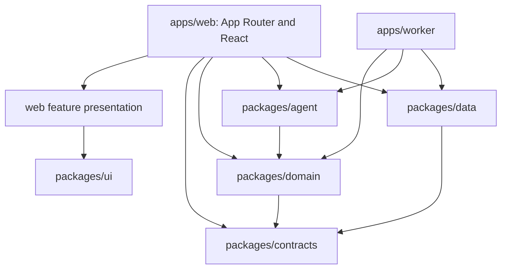

# Application Folder and Component Structure Plan

**Status:** Approved architecture and UI foundation decisions; no application folders or packages are being created yet.

## Purpose and constraints

Plan the first codebase structure for the SalesMora application from the approved product architecture and the existing screen prototypes. The structure should support:

- A Next.js App Router web application with a persistent signed-in workspace shell.
- A separately deployed Node.js worker for delayed workflows, retries, connectors, email intake, and embedding generation.
- Shared business rules between the web app and worker, backed by PostgreSQL/Knex and Redis.
- A cross-screen, context-aware assistant with a registry of screen contexts and tools.
- A curated documentation knowledge base using pgvector in the MVP.
- Reusable brand components and Storybook, without turning every page into a component-library package.
- Incremental delivery by product area and screen, based on the [Interactive Prototype Plan](interactive-prototype-plan.md).

This is a modular-monolith proposal in one repository/workspace. It keeps runtime boundaries explicit without proposing separate services or packages for every feature.

## Proposed top-level structure

```text
salesmora/
├── apps/
│   ├── web/                         # Next.js app: routes, layouts, UI composition, BFF
│   └── worker/                      # Node.js process: Redis jobs, schedules, async workflows
├── packages/
│   ├── contracts/                   # Shared validated DTOs and event/tool schemas
│   ├── domain/                      # Business use cases, policies, domain types
│   ├── data/                        # Knex, migrations, repositories, pgvector persistence
│   ├── agent/                       # Runtime, surface registry, context resolver, tools, KB retrieval
│   └── ui/                          # MUI theme, branded primitives, icons, cross-feature components + Storybook
├── infrastructure/
│   └── local/                       # Compose files or local service configuration, if needed
├── knowledge/
│   └── operations/                  # Reviewed, source-controlled agent help articles (Markdown)
├── docs/                            # Product, architecture, operational plans
├── prototype/                       # Standalone HTML prototypes; reference only
├── package.json                     # Workspace scripts and package manager metadata
├── tsconfig.base.json               # Shared TypeScript defaults
├── eslint.config.mjs                # Shared lint configuration
└── README.md
```

The names and boundaries are proposals. In particular, review whether `contracts`, `domain`, and `data` should be distinct packages or begin as folders within one `packages/core` package. The goal is to establish import boundaries and runtime ownership, not maximize package count.

## Web application structure

Use `apps/web/src/app` for URL and layout composition, with route groups to share layouts without adding URL segments. Keep route files small: resolve params, call server-side use cases, select the page-level feature component, and define metadata/loading/error boundaries. Keep implementation details in feature modules or shared packages.

```text
apps/web/
├── src/
│   ├── app/
│   │   ├── layout.tsx               # Root HTML shell, fonts, global CSS
│   │   ├── globals.css
│   │   ├── (public)/                # Marketing, help, public shareable pages
│   │   ├── (auth)/                  # Login, registration, password recovery
│   │   ├── (onboarding)/            # Screen 02 organization setup
│   │   ├── (workspace)/             # Persistent authenticated app shell
│   │   │   ├── layout.tsx           # Navigation, workspace chrome, assistant slot
│   │   │   ├── home/page.tsx
│   │   │   ├── leads/page.tsx
│   │   │   ├── leads/[leadId]/page.tsx
│   │   │   ├── leads/new/page.tsx
│   │   │   ├── customers/page.tsx
│   │   │   ├── customers/[customerId]/page.tsx
│   │   │   ├── jobs/page.tsx         # Board default
│   │   │   ├── jobs/new/page.tsx
│   │   │   ├── jobs/[jobId]/page.tsx
│   │   │   ├── estimates/page.tsx
│   │   │   ├── estimates/new/page.tsx
│   │   │   ├── estimates/[estimateId]/page.tsx
│   │   │   ├── campaigns/page.tsx
│   │   │   ├── campaigns/new/source/page.tsx
│   │   │   ├── campaigns/[campaignId]/page.tsx
│   │   │   ├── campaigns/[campaignId]/setup/source-account/page.tsx
│   │   │   ├── campaigns/[campaignId]/setup/intake/page.tsx
│   │   │   ├── campaigns/[campaignId]/setup/form/page.tsx
│   │   │   ├── campaigns/[campaignId]/setup/workflow/page.tsx
│   │   │   ├── campaigns/[campaignId]/setup/follow-up/page.tsx
│   │   │   ├── campaigns/[campaignId]/setup/review/page.tsx
│   │   │   ├── intake-review/page.tsx
│   │   │   ├── intake-review/[proposalId]/page.tsx
│   │   │   ├── reports/page.tsx
│   │   │   ├── calendar/page.tsx
│   │   │   └── settings/            # Settings sub-navigation and sections
│   │   │       ├── page.tsx
│   │   │       ├── business/page.tsx
│   │   │       ├── team/page.tsx
│   │   │       ├── billing/page.tsx
│   │   │       ├── job-notifications/page.tsx
│   │   │       └── integrations/page.tsx
│   │   └── api/
│   │       ├── agent/turn/route.ts
│   │       ├── widgets/[publicKey]/submissions/route.ts
│   │       ├── oauth/[provider]/callback/route.ts
│   │       └── webhooks/[provider]/route.ts
│   ├── features/                    # Page/domain-specific React presentation
│   │   ├── home/
│   │   ├── leads/
│   │   ├── customers/
│   │   ├── jobs/
│   │   ├── estimates/
│   │   ├── campaigns/
│   │   ├── reports/
│   │   ├── settings/
│   │   └── integrations/
│   ├── components/
│   │   ├── shell/                   # Sidebar, top bar, page frame, settings nav
│   │   ├── assistant/               # Assistant surfaces and chat interaction UI
│   │   └── feedback/                # Toasts, empty states, errors, loading UI
│   └── server/
│       ├── auth/                    # Session and current-user helpers
│       ├── access/                  # Tenant, role, plan and resource checks
│       ├── actions/                 # Server Actions when appropriate
│       └── bootstrap/               # Web process dependency wiring
├── public/                           # Static assets served by the Next.js app
├── .storybook/                      # Storybook preview/decorators for shared UI
└── next.config.ts
```

Use actual Next.js special files (`page.tsx`, `layout.tsx`, `loading.tsx`, `error.tsx`, and `route.ts`) only where their routing or rendering behavior is needed. Route groups such as `(workspace)` are organizational and do not appear in URLs. Do not put domain/business logic in page files or let browser components import database, credential, worker, or agent-runtime modules.

### Route map against the prototypes

Keep this primary sidebar on every signed-in screen, in this order: **Home, Leads, Customers, Estimates, Jobs, Calendar, Reports, Campaigns**. Anchor **Settings** at the bottom; selecting it reveals the submenu **Business profile, Team, Integrations, Workflows & notifications, Plan & billing**. Permission and plan checks determine which destinations a user can open, but do not silently change the shared labels or order.

| Product area | Proposed route family | Prototype screens |
|---|---|---|
| Authentication and onboarding | `/login`, `/register`, `/setup` | 1, 1a, 2 |
| Home | `/home` | 3–4, role-specific home states |
| Leads and customers | `/leads`, `/leads/new`, `/leads/[leadId]`, `/customers`, `/customers/[customerId]` | 5–8 |
| Jobs | `/jobs` (board default, `?view=table` for table), `/jobs/new`, `/jobs/[jobId]` | 9–12 and job creation/detail follow-ups |
| Reports and exports | `/reports`, `/reports/[reportKey]`, `/exports/new` | 13–15 |
| Settings and integrations | `/settings/...`, including `/settings/integrations` | 16, 31–32, settings subpages |
| Campaigns | `/campaigns`, `/campaigns/new/source`, `/campaigns/[campaignId]`, `/campaigns/[campaignId]/setup/{source-account,intake,form,workflow,follow-up,review}` | 17–25 and 28–29 |
| Intake review | `/intake-review`, `/intake-review/[proposalId]` | 26–27 |
| Scheduling | `/calendar` or `/schedule` | 30–31 |
| Estimates | `/estimates`, `/estimates/new`, `/estimates/[estimateId]` | 33–34 and estimate preview/publish states |
| Public lead capture | `/f/[publicKey]` or `/share/[publicKey]` | Hosted form and shareable link from 20–21 |

The proposed route approach is approved: use semantic URLs rather than prototype screen numbers; create a campaign draft after source selection so setup has a stable ID; keep settings subpages under `/settings`; use a query parameter for the Jobs board/table view. Exact campaign-step slugs can be refined during implementation without changing this route shape.

## Feature module pattern

Each `apps/web/src/features/<area>` module owns React presentation that is specific to that product area. A feature can start small and add subfolders only as needed:

```text
features/leads/
├── components/
│   ├── lead-list.tsx
│   ├── lead-filters.tsx
│   ├── lead-detail-header.tsx
│   └── lead-form.tsx
├── assistant/
│   └── lead-assistant-panel.tsx
├── view-models.ts                 # UI-only formatting/composition types
└── index.ts                       # Optional public exports; avoid giant barrels
```

Feature UI calls typed server actions or route handlers; these call application use cases in `packages/domain`. The feature component must not talk directly to Knex or construct privileged agent tools. Put shared cross-feature controls (button, input, dialog, status badge, data table primitives) in `packages/ui`; keep LeadTable/JobBoard/EstimatePreview in their feature module unless multiple product areas truly reuse the same behavior.

## Shared component plan

Organize components by responsibility and reuse level:

```text
packages/ui/src/
├── primitives/                     # Button, input, select, badge, tooltip
├── layout/                         # Card, section, page header, responsive grid
├── overlays/                       # Dialog, drawer, popover, confirmation
├── data-display/                   # Table primitives, empty state, activity item
├── forms/                          # Form field, validation message, field group
├── assistant/                      # Chat message, composer, context label, action review
├── icons/
├── styles/                         # Tokens, theme, typography
└── index.ts
```

The app shell owns product navigation and persistent chrome. Page modules compose shared primitives into product widgets. Use composition and accessible semantic primitives rather than adding business rules to generic UI components.

### UI framework, branding, and iconography

- Use **Material UI (MUI)** as the default React component framework wherever its components fit the interaction and accessibility needs. Build product-specific components when a workflow needs behavior or layout that MUI does not provide cleanly; do not force every screen into a stock MUI look.
- Keep the SalesMora.ai workspace identity consistent with the [brand guide](branding.md): use the Mosaic logo, Blue & Seafoam palette (`#3B6FA5` primary, `#7CCBB7` seafoam, `#23384D` navy ink, `#F4F8FC` cool white), and Source Sans 3 (`'Source Sans 3', 'Segoe UI', Arial, sans-serif`). Centralize these colors, typography, spacing, shape, elevation, and component overrides in the shared `packages/ui` theme/tokens. App-wide MUI theme setup belongs in the web app provider; Storybook should use the same theme and global styles.
- Use **`@mui/icons-material`** as the standard library for in-product UI icons. Import icons through `packages/ui/src/icons` (or a small approved icon map) so icon choices and variants stay consistent. Do not mix in emoji, Unicode glyphs, icon fonts, or another icon package as UI iconography. Product and third-party service logos remain brand assets, not substitutes for UI icons.
- **Do not use favicons anywhere in the application.** Do not add favicon files or browser icon metadata/routes, and never use a website's favicon as an in-product icon. This rule is separate from the SalesMora wordmark/logo and approved service logo assets.
- Prefer MUI's accessible components and keyboard behavior, and check responsive layout, focus visibility, contrast, and reduced-motion behavior when applying the brand theme.

The assistant needs one shared **interaction component** with configurable placement (hero, inline, drawer) because the prototypes intentionally make it prominent on different pages. A page supplies a stable `surfaceKey`, selected record references, and visible UI state. The server-side registry in `packages/agent` resolves actual context and tools. Suggested UI building blocks include `AssistantPanel`, `Conversation`, `MessageList`, `MessageComposer`, `ContextBadge`, `SuggestedPrompt`, `ActionReviewCard`, and `ApprovalControls`; avoid a separate agent implementation per page.

Stories should live next to shared UI components as `*.stories.tsx` where that supports ownership, while `.storybook/preview.tsx` applies global styles, branding, and lightweight providers. Use mock typed data and callbacks. Page/domain widgets can have stories when they benefit from isolated review, but Storybook is not a replacement for composing and navigating real routes.

## Shared server packages and responsibilities

### `packages/contracts`

- Shared Zod schemas/types for API inputs/outputs, event payloads, assistant context envelopes, and tool arguments.
- No database access, model SDKs, secrets, or UI dependencies.
- Validate any value crossing a trust boundary, even if the browser already validated it.

### `packages/domain`

- Lead, customer, job, estimate, campaign, scheduling, settings, and billing use cases/policies.
- Business invariants, validation, tenant-scoped operation inputs, approval requirements, idempotency contracts.
- No Next.js route imports; worker and web app use the same use cases.

### `packages/data`

- Knex configuration, versioned schema migrations, repository implementations, transactions, and PostgreSQL-specific queries.
- `pgvector` schema/repository for published knowledge chunks and embeddings.
- Separate repositories for app records, audit/action records, and agent checkpoint persistence where needed; avoid leaking Knex builders through domain interfaces.

### `packages/agent`

- Shared LangChain runtime and model-provider adapter.
- Surface-key registry and page/task context resolvers.
- Typed read/draft/commit tool registry, tool authorization bindings, approval flow integrations.
- Documentation ingestion/chunking/retrieval interfaces for `knowledge/operations`; call an embedding provider through the worker pipeline.
- Agent prompts/policies, structured outputs, bounded history and trace redaction.

### `apps/worker`

- BullMQ on Redis queue worker entry point, job handlers, schedules, retries, and dead-letter handling.
- Process delayed follow-ups, Gmail intake, connector sync, notifications, campaign schedules, and knowledge-document embedding/reindex jobs.
- Import domain/data/agent packages as needed; do not import Next.js pages, React, or browser code.

## Dependency direction



Enforce these directions with workspace exports and lint/import boundaries as the implementation matures. In particular, `packages/domain` should not import Next.js, React, Knex, model providers, or worker queue clients. Database access is injected through repository interfaces; the agent calls domain use cases through tools; queue dispatch is an infrastructure adapter invoked by the appropriate use case.

## Naming and placement rules

- **Route files:** `page.tsx`, `layout.tsx`, `loading.tsx`, `error.tsx`, `route.ts`; keep them focused on routing and composition.
- **React components:** PascalCase exports; kebab-case filenames (`lead-detail-header.tsx`).
- **Server-only modules:** use explicit server-only boundaries where available and never re-export secrets/DB code from a browser-importable barrel.
- **Schemas:** keep shared boundary schemas in `packages/contracts`; local UI-only form state can live with the feature.
- **Tests:** colocate unit tests with domain/data/agent modules or mirror package `test/` folders; keep end-to-end journeys under an app-level browser-test directory once the test stack is selected.
- **Workspace tooling:** use `pnpm` workspaces with one root `pnpm-workspace.yaml` and lockfile; keep workspace scripts and shared lint/import-boundary rules at the root.
- **Test placement:** colocate unit tests beside the module as `*.test.ts` or `*.test.tsx`; put browser journey tests in `apps/web/e2e`. Select the unit-test runner when initializing the app; use Playwright for browser journeys.
- **Stories:** `ComponentName.stories.tsx`, colocated with shared component source; mock network/service behavior.
- **Migrations:** one ordered owner in `packages/data`; do not keep separate web and worker migration histories.
- **Prototype assets:** `prototype/` remains separate and is linked as design/behavior reference; do not import standalone prototype scripts into the production bundle.

## Review checkpoints

Review this plan in sequence. Mark each section approved or revise it before moving to the next:

1. **Workspace shape — Approved:** one repository with `apps/web`, `apps/worker`, and shared packages; deploy the web and worker as separate Railway services.
2. **Package boundaries — Approved:** keep `contracts`, `domain`, `data`, `agent`, and `ui` as separate workspace packages.
3. **URL and route layout — Approved:** use semantic URLs; campaign setup gets a stable draft ID after source selection; settings pages stay under `/settings`; Jobs board/table uses `?view=table`.
4. **Feature-component boundary — Approved:** generic primitives/layout/forms/overlays in `packages/ui`; domain widgets stay with their feature and move to shared UI only when another area needs the same behavior.
5. **Assistant components and data boundary — Approved:** shared display-only chat pieces in `packages/ui`, connected assistant placement in the web app, and runtime/context/tools in server-only `packages/agent`.
6. **Knowledge base ownership — Approved:** reviewed Markdown articles in `knowledge/operations`, indexed by the worker into pgvector; assistant answers cite articles/sections; Storybook uses mock citations.
7. **Naming, tests, and tooling — Approved:** kebab-case filenames with PascalCase React exports; `pnpm` workspaces with one root lockfile; colocated `*.test.ts`/`*.test.tsx` unit tests; Playwright journeys in `apps/web/e2e`; root-managed lint and import-boundary rules. Choose the unit-test runner when initializing the app.
8. **Branding and UI foundation — Approved:** use MUI wherever it fits; use the Mosaic logo, Blue & Seafoam palette, and Source Sans 3 from the brand guide; use `@mui/icons-material` for in-product UI icons; do not use favicons or website favicons as UI icons.

## Official references

- [Next.js project structure](https://nextjs.org/docs/app/getting-started/project-structure) — App Router file conventions and project organization.
- [Next.js route groups](https://nextjs.org/docs/app/api-reference/file-conventions/route-groups) — organizing routes without changing URL paths.
- [Next.js layouts and pages](https://nextjs.org/docs/app/getting-started/layouts-and-pages) — App Router composition.
- [Next.js Route Handlers](https://nextjs.org/docs/app/getting-started/route-handlers) — HTTP endpoints in the App Router.
- [Storybook Next.js with Vite](https://storybook.js.org/docs/get-started/frameworks/nextjs-vite) — component workbench integration.
- [Material UI installation](https://mui.com/material-ui/getting-started/installation/) — MUI packages and base setup.
- [Material UI with Next.js](https://mui.com/material-ui/integrations/nextjs/) — App Router rendering/cache integration.
- [Material UI icons](https://mui.com/material-ui/material-icons/) — standard React icon package.

## Related plans

- [Product and delivery roadmap](salesmora-product-roadmap.md)
- [Interactive prototype plan](interactive-prototype-plan.md)
- [Context-aware agent architecture](context-aware-agent-architecture.md)
- [Local development setup](local-development.md)
