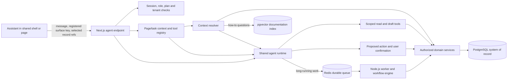

# Context-Aware Agent Architecture

**Status:** Architecture decisions reviewed and agreed; implementation has not started.

## Purpose

SalesMora has agent interactions across Home, Leads, Customers, Jobs, Estimates, Campaigns, Reports, Settings, and setup flows. The agent should understand the user's current task and relevant record without receiving unrestricted access to every page, database table, or integration.

This plan describes how the application can resolve page context, provide an appropriately scoped toolset, retrieve business data, preserve conversation state, and gate changes. It extends the existing architecture in the [Product and Delivery Roadmap](salesmora-product-roadmap.md), which identifies Next.js App Router, PostgreSQL, Redis, a separate worker, and LangChain for bounded agent tasks.

## Recommendation

Build **one shared server-side agent runtime** with a registry of page/task contexts and narrow, domain-level tools. Each assistant surface tells the server which registered screen or task it is serving and which record the user has selected. The server authenticates the user, resolves that route key against a registry, loads only the relevant context through authorized domain services, and gives the model only the tools allowed for that surface and user.

Use PostgreSQL as the system of record and normal SQL/domain services for CRM data. The MVP will use `pgvector` for semantic search over a curated SalesMora knowledge base of operations and product help (for example, “How do I create a lead?”). Knowledge retrieval explains how to use the product; it does not choose tools, retrieve live CRM references, or authorize actions.



## How the agent knows which screen it is on

The shared assistant UI should receive a stable, typed **surface key** from the app route/layout (for example, `leads.list`, `lead.detail`, `job.detail`, `campaign.setup.email-mapping`). It should not infer the page by reading the DOM, guessing from the user's wording, or using an arbitrary URL string as authorization.

For each turn, the UI sends a small context envelope:

```json
{
  "surfaceKey": "job.detail",
  "recordRefs": [{ "type": "job", "id": "job_123" }],
  "uiState": { "section": "activity" },
  "message": "Summarize the latest updates and flag anything overdue."
}
```

The example is illustrative. In production:

- The server validates `surfaceKey` against a code-owned registry. Unknown keys receive a safe generic assistant experience or a validation error.
- `recordRefs` are untrusted identifiers. The server reloads each record through the tenant-scoped data access layer and checks access for the current user.
- The server derives user ID, organization ID, role, and plan from the authenticated session and database. It never trusts client-supplied identity or authorization claims.
- Workspace permission roles are Owner, Admin, and Member. Office/Field work profiles may inform page presentation, but they never expand tool access or record permissions.
- `uiState` is optional and limited to useful, validated UI details (selected filters, view mode, or section). Do not send the full page DOM or hidden form contents by default.
- The server controls the final prompt context and tool list. The browser communicates intent; it does not grant capabilities.

On a client-side route change, the assistant updates its surface key and selected record references for the next request. The UI should visibly indicate the active context (for example, **Using Job #1042**) and provide a way to change or clear it.

## Context layers and where data comes from

Assemble context on the server for each turn. Keep raw typed state and format prompt text at the agent boundary; do not use a prebuilt, long prompt as the database.

| Context layer | Example contents | Source | Lifetime |
|---|---|---|---|
| Product behavior | Agent role, response format, safety and approval rules | Versioned server prompt/configuration | Across requests |
| User and access | Authenticated user, organization, role, permissions, plan entitlements | Session plus authorization/data-access layer | Revalidated each request/action |
| Workspace profile | Business name, trade, services, service range, defaults, approved tone/templates | PostgreSQL domain services | Current workspace state |
| Page/task | Current page, selected record, filters or form draft needed for the task | Registered surface key plus server-resolved records; minimal validated UI state | Current turn/task |
| Conversation | Messages and graph execution state for the active thread/task | LangGraph PostgreSQL checkpointer (`PostgresSaver`) for durable thread-scoped state; optionally an app-owned message table for transcript/search/retention needs | Thread/task lifetime |
| Cross-thread memory | Explicit user preferences or durable, user-approved facts | LangGraph PostgreSQL store (`PostgresStore`) or an app-owned preferences table | Across threads, only when needed |
| Business actions | Proposed changes, approval actor/time, idempotency key, execution outcome | SalesMora-owned PostgreSQL domain/action/audit tables | Product retention policy |
| Knowledge retrieval | Approved SalesMora help and operations guidance (for example, “How do I create a lead?”) | Curated knowledge articles, chunked and indexed for semantic retrieval with PostgreSQL `pgvector` | Retrieved per query, with article/chunk references |
| External systems | Gmail message, calendar event, integration delivery status | Connector service, fetched only when an authorized tool needs it | Current tool call/result |

Use regular PostgreSQL queries for exact, current facts such as lead status, estimate totals, assignments, permissions, campaign settings, and job deadlines. These facts are structured and need predictable filters, joins, and transaction rules. Do not embed every CRM row and use nearest-neighbor search to answer questions that SQL can answer exactly.

## Page/task registry and tools

Keep a code-owned registry that maps surface keys to context resolvers, tool identifiers, and response behavior. This is a capability boundary and a maintainable map of where the agent can help.

| Surface key (examples) | Context resolver | Initial tools (examples) |
|---|---|---|
| `home.owner`, `home.team` | Workspace summary, role-specific attention counts, recent/overdue records | `get_home_summary`, `search_records`, `draft_create_lead`, `draft_create_task` |
| `leads.list`, `lead.detail` | Active filters or one authorized lead, recent activity, linked customer/job | `search_leads`, `get_lead`, `draft_create_lead`, `draft_update_lead`, `draft_add_note`, `draft_convert_lead` |
| `customers.list`, `customer.detail` | Matching authorized customer and related leads/jobs/activity | `search_customers`, `get_customer`, `draft_create_customer`, `draft_update_customer` |
| `jobs.board`, `jobs.table`, `job.detail` | Board filters or a job, team, schedule, deadline, activity and attachments metadata | `search_jobs`, `get_job`, `draft_create_job`, `draft_update_job`, `draft_schedule_job`, `draft_add_progress_note`, `list_job_files` |
| `estimates.list`, `estimate.editor`, `estimate.detail` | Estimate, line items, linked customer/job, tax and business identity | `search_estimates`, `get_estimate`, `draft_create_estimate`, `draft_update_estimate`, `draft_preview_estimate` |
| `campaigns.list`, `campaign.setup.*`, `campaign.detail` | Campaign draft/status, source, mapping, workflow and integration state | `search_campaigns`, `get_campaign`, `draft_campaign_change`, `preview_campaign_rules`, `draft_pause_campaign` |
| `reports.*` | Requested date range, tenant-scoped report aggregates, filter definitions | `get_report_summary`, `search_records` (read-only) |
| `settings.*`, `integrations.*` | Relevant profile, team, plan entitlement, connector health/details | `get_settings_summary`, `get_integration_status`, `draft_settings_change`, `draft_connect_or_reconnect` |

Registry entries should use stable tool IDs and typed input/output schemas. Tool implementations call shared domain services, not arbitrary SQL supplied by the model. Divide tools by effect:

1. **Read tools** retrieve authorized facts; enforce tenant, role, plan, and record scope on every call.
2. **Draft tools** create a proposed change (including a draft ID and a concise before/after summary) without committing it.
3. **Commit tools** execute a reviewed draft only after the app receives explicit user confirmation. Recheck access, current record version, business rules, and idempotency at commit time.

The model may propose a tool call, but it never supplies an authorization decision. Tool allowlists improve relevance and reduce accidental capability exposure; every tool still enforces authorization independently. Hiding a tool in the UI or omitting it from the model is not a security control by itself.

### Examples of screen-aware behavior

- On the **lead list**, “Create a lead” opens a lead draft using only the supplied details and asks about missing required fields. It does not silently save.
- On a **lead detail**, “Turn this into a job” uses the lead ID as a candidate record reference, reloads the lead and permissions from PostgreSQL, and presents a reviewed job draft.
- On **job detail**, “Move this to next Tuesday” reads the current schedule and proposes a date change; commit requires confirmation and records activity.
- On **Reports**, the agent can summarize an authorized report result but cannot mutate CRM records through report tools.
- On **campaign intake setup**, the tool set is limited to campaign draft, sample parsing, mapping preview, and workflow draft actions; it cannot send email or activate the campaign until the user follows the explicit review/approval flow.

## Conversation continuity and state

Treat conversation state as a record of what the user and agent said and which task/draft is in progress—not as an authorization cache or canonical business data.

Recommended initial model:

- Use a **LangGraph checkpointer backed by PostgreSQL** for short-term, thread-scoped graph state: conversation messages needed to resume the thread, workflow progress, and human-in-the-loop interrupts. `MemorySaver`/`InMemorySaver` is suitable for local development, not production because process restarts lose its state.
- Use a persistent LangGraph **Store** only for intentional cross-thread memory, such as a user-approved preference. Namespace memory by the authenticated organization and user; validate access in application code. Do not treat retrieved memories as permissions or canonical workspace data. If no cross-thread memory feature is needed, do not add a Store yet.
- Keep action drafts, confirmations, business mutations, and audit records in SalesMora-owned PostgreSQL tables with `organization_id`, `user_id`, target resource, status, and timestamps. The checkpointer can track workflow progress, but it is not the authoritative audit record or source of truth for CRM changes.
- Decide whether the checkpointed message history also serves the chat UI. It can avoid duplicating the transcript, but an app-owned message table may be appropriate if the UI needs efficient message pagination/search, organization-level retention/deletion controls, or audit queries. If both are used, define which is canonical and avoid inconsistent dual writes.
- Each turn carries fresh page context; don't assume an earlier page or role is still current after navigation.
- Keep an action draft linked to the target record and its version. Expire or invalidate it when its context is stale; re-read the data before commit.
- Use a task-scoped thread for multi-step work. A user may continue a task after navigation, but the UI should show which record/task the conversation is using. Do not carry unrelated page context into a new task implicitly.
- Keep only relevant recent messages and a bounded, source-linked summary in the model context. Persist raw messages and typed references; create the prompt from current authorized state each turn.
- Redis is for durable queued work, retries, and asynchronous workflow jobs under the current architecture. It is not the system of record for CRM data or user approval state.

LangGraph's current persistence model distinguishes the checkpointer (short-term graph state scoped to a `thread_id`) from the Store (application-defined data shared across threads). Both have PostgreSQL-backed JavaScript implementations. Use the checkpointer for pause/resume and thread continuity; use the Store only if SalesMora introduces a deliberate cross-thread memory feature. LangGraph state should contain raw task data and references; format instructions and context when executing each node.

## Knowledge-base retrieval and vector search

The intended vector-search use is a **SalesMora knowledge base** for product and operations guidance. For example, store reviewed chunks explaining “How do I create a new lead?”, “How do I create an estimate?”, or “How do I change a job deadline?” When a user asks a how-to question, retrieve a few relevant chunks and answer with a source/link so the user can follow the instructions.

The knowledge base should be separate from the agent's live application context and capabilities:

- **Screen awareness** comes from the registered surface key and server-resolved page/record context.
- **Available actions** come from the code-owned screen/tool registry and current authorization checks.
- **Current CRM facts** come from authorized PostgreSQL/domain-service queries.
- **How-to explanations** come from retrieval over approved, versioned knowledge articles.

If a user asks “How do I create a lead?”, knowledge retrieval can explain the steps. If they ask “Create a lead for this caller,” the agent uses the current screen context and the lead draft/commit tools. A retrieved how-to article must never grant tools or authorize an action.

An article can be authored as a complete page and split into small, coherent chunks that preserve headings and step order. Store metadata with each chunk such as article ID, title, section, URL, product area, applicable role/plan, status, content version, and updated date. Retrieve only published/current chunks; include citations or source links in the answer. Re-index edited or retired articles and remove obsolete chunks. If help content has role- or plan-specific variants, filter by the current authenticated role/plan before returning text to the model.

`pgvector` is a PostgreSQL extension for vector storage and exact or approximate nearest-neighbor search. It is the selected MVP implementation for the documentation knowledge base. Railway's standard PostgreSQL image does not include `pgvector`; use the [Railway PostgreSQL-with-extensions template](https://railway.com/deploy/postgresql-with-extensions) with `vector` enabled. Pin the PostgreSQL major and pgvector package versions, and treat the customized image and upgrade path as operator-owned. Keep the extension version and embedding dimensions explicit in migrations/configuration. Consider adding PostgreSQL full-text search as a hybrid retrieval signal if evaluation shows it improves exact title/phrase matches.

It should not be used to:

- Decide which records a user is allowed to see.
- Replace SQL filters for tenant, owner, status, date, plan, or relationships.
- Hold the only copy of a source document, CRM record, action draft, or conversation.
- Decide which actions the current screen supports or retrieve actionable CRM references.
- Retrieve unpublished/stale instructions or rely on the model to determine whether an article is current.

For a product-wide help corpus, chunk metadata should include publication status, version, role/plan applicability, and product-area scope. If SalesMora later indexes tenant-owned documents, also include organization ID and source-level visibility; filter by tenant/access before returning text, then re-fetch the source through the DAL. Do not embed secrets, OAuth tokens, or unnecessary personal data. Define update/deletion handling so retired or changed instructions cannot remain available as stale indexed text.

**Options:**

- **Option A — Curated help articles with keyword/full-text search:** Simpler alternative if vector support cannot be deployed or a retrieval evaluation shows lexical search is enough. Store canonical articles in source-controlled or managed documentation and return exact section links.
- **Option B — Curated help articles with PostgreSQL plus pgvector (selected for MVP):** Keep article/chunk metadata and vectors in PostgreSQL, generate embeddings through the background worker, and retrieve semantically relevant chunks for agent answers. Railway's standard PostgreSQL image does not include the extension; use its [PostgreSQL-with-extensions template](https://railway.com/deploy/postgresql-with-extensions) with `vector` enabled and verify versions, backups, restore, and upgrade process before production rollout.
- **Option C — External vector service:** Consider only if corpus size, retrieval throughput, isolation, or operations justify a separate service. It adds synchronization, network, privacy, and deletion-consistency work. PostgreSQL remains canonical, and every result must still be authorized and revalidated there.

Do not embed live leads, customers, jobs, or emails for this feature. Start with a small set of reviewed operations/help articles, collect representative questions, and evaluate whether retrieval returns the right section. For PostgreSQL vector-indexing tradeoffs see the [pgvector project documentation](https://github.com/pgvector/pgvector).

## Architecture options

| Option | Shape | Benefits | Costs / risks | Fit |
|---|---|---|---|---|
| **A. Shared runtime + registered surfaces and scoped tools** | One orchestration/runtime; server-side registry selects context and tools per screen/task. | Consistent UX, shared auth/audit/tool contracts, straightforward reuse, screen context remains explicit. | Registry and domain tools need disciplined ownership. | **Recommended for SalesMora.** |
| **B. One independent agent per page** | Each screen owns prompts, context loading, tools, state and endpoints. | Local customization can be quick for a small proof of concept. | Duplicated auth and business rules, inconsistent behavior, growing prompt/tool sprawl, hard cross-page continuity. | Avoid as the default. Keep separate workflows only for genuinely different bounded processes (for example email extraction or estimate preparation). |
| **C. One universal agent with every tool** | One agent sees every tool and gets broad context on every page. | Simple initial wiring and maximum apparent flexibility. | Unnecessary context/token cost, confusing tool choice, excessive capabilities, higher privacy/security blast radius. | Not recommended. |
| **D. Frontend decides page context and allowed tools** | Browser sends page data and a tool list; server mostly forwards it. | Fast mockup. | Browser-controlled context and tool availability are not trustworthy security boundaries. | Prototype only; never for production authorization. |

The recommended design combines A with small, explicit workflow graphs where a task needs deterministic stages, retries, durable waits, or human approvals. Avoid adopting a larger multi-agent framework until a real workflow requires it.

## Security, approval, and reliability requirements

- Authenticate each turn; derive tenant/user/role/plan on the server and enforce them in the data-access/domain layer.
- Treat every server action and route handler as an externally callable boundary; repeat authorization on every read and mutation.
- Return minimum necessary context to the model; redact secrets and avoid sending unrelated customer records.
- Scope connectors and tools to the current tenant and user permissions. Gmail is read-only for intake under the current product direction.
- Require explicit confirmation before committing record changes or sending/publishing/activating external actions, unless the user has explicitly configured that exact automation.
- Revalidate authorization and current record state at commit time; protect against replay with idempotency keys and optimistic version checks.
- Store action proposals, approval actor/time, tool name, input/output references, outcome, and errors in auditable records. Do not treat model traces as the audit log.
- Bound tool count, result size, query range, execution time, and retries. Summarize large result sets through server-side aggregate queries rather than handing whole tables to the model.
- Treat email bodies, uploaded files, notes, and retrieved text as untrusted data that can contain prompt injection. Retrieved text is evidence, not authority to expand tool access or ignore policy.
- Log operational metadata and redacted traces; set retention/access controls for prompts and completions containing customer data.

Next.js's own guidance recommends a server-side Data Access Layer, minimal DTOs, and authorization checks in Server Actions and Route Handlers. LangGraph's JavaScript guidance similarly frames agent work as discrete data/action/user-input steps and recommends storing raw state and formatting context at execution time. See the references below.

## Delivery sequence

1. **Define the contract:** Add the surface-key registry, context envelope schema, tool schema conventions, action-draft lifecycle, and authorization checklist before adding an LLM endpoint.
2. **Build domain tools first:** Implement and verify read/draft/commit services for one workflow (recommended: create/update lead) without an agent UI dependency.
3. **Pilot the agreed surfaces:** Add the shared assistant to Home, Leads list, and Lead detail. Send minimal route/record context, resolve server-side, and offer only the lead tools required for each surface.
4. **Add continuity and review:** Persist task threads/action drafts; display active record context; implement explicit confirmation, stale-draft rejection, idempotency, and audit records.
5. **Expand by registry entry:** Add Home, Customers, Jobs, Estimates, Campaigns, Reports, Settings, and integrations only when each surface has a concrete task and tool contract.
6. **Build the MVP knowledge base:** Store reviewed help/operations articles and chunk metadata in PostgreSQL, generate and refresh embeddings in a worker, and retrieve source-linked chunks with pgvector. Keep retrieval informational and separate from page tools and CRM queries; evaluate retrieval quality with representative questions.
7. **Move long-running work to the worker:** Use BullMQ on Redis for delayed work, retries, connector operations, and resumable workflows; never keep a long-running agent operation inside a web request. PostgreSQL remains the system of record for task and workflow state.

## Decisions and implementation validation

### Recommended starting decisions

- One shared server-side runtime with typed surface keys and code-owned tool registry.
- PostgreSQL/domain services are the source of truth for CRM records and actions. The MVP uses pgvector only for retrieving approved how-to documentation, not actionable references.
- The client sends context hints and selected record references; the server resolves all authoritative context and permissions.
- Tools are divided into read, draft, and confirmed commit operations.
- LangGraph's PostgreSQL checkpointer stores short-term agent/thread execution state; SalesMora-owned tables remain authoritative for approvals, business actions, and audit. Add a PostgreSQL Store only for a concrete cross-thread memory use case; Redis is reserved for asynchronous work.
- Conversations are task-scoped. Continue a thread across screens when the user is continuing the same task; start a fresh thread for an unrelated task.
- Call models through a server-side provider adapter and use OpenAI for the MVP. Evaluate GPT-6 Luna first on representative lead-search, email-extraction, and draft-action tasks; it is the cost-sensitive primary candidate. Compare it with GPT-6.1 Sol, and use Sol only if Luna misses the agreed quality bar. Validate tool-call and structured-output quality, latency, and cost before production. OpenAI API data is not used for training by default; minimize customer context, set Responses API storage off, and review the applicable data-use and retention terms before sending customer data. Standard abuse-monitoring logs may retain content for up to 30 days; Zero Data Retention requires eligibility and approval.
- Use LangChain's standard agent/tool loop for page assistants with the PostgreSQL checkpointer for task continuity. Use explicit LangGraph workflows only when a bounded process needs durable pause/resume, multiple stages, or branching; keep scheduled work in the Redis-backed worker.
- Use BullMQ with Redis for the separate Node.js worker. BullMQ requires AOF persistence and `maxmemory-policy=noeviction`. Railway's standard Redis docs do not guarantee these settings, so deploy a persistent custom-configured Redis service, verify restart and memory-limit behavior in staging, and account for owning its configuration, upgrades, backups, and recovery.
- Retain conversation/checkpoint data for 90 days after last activity, allow earlier user deletion, retain redacted operational traces for 30 days, keep business-action approvals under the normal SalesMora audit-retention policy, and retain documentation embeddings only while their source articles are published.

### Implementation validation before production

These are delivery checks for the decisions above, not open architecture choices:

1. Evaluate GPT-6 Luna first on representative lead-search, email-extraction, and draft-action tasks. Compare with GPT-6.1 Sol only if Luna misses the quality bar. Measure tool-call/structured-output quality, latency, and cost; review OpenAI data-use/retention terms and confirm storage controls before sending customer data.
2. Deploy Railway's PostgreSQL-with-extensions template with `vector` enabled. Pin the PostgreSQL major and pgvector package versions; verify the extension loads, backups restore, and the documented upgrade procedure works in staging. The customized image and its upgrade path must be reviewed as an operator-owned database service.
3. Implement and verify the 90-day conversation/checkpoint expiry, user-initiated deletion, 30-day redacted trace retention, existing business audit-retention alignment, and embedding removal/re-indexing when article publication changes.

### Decisions made

| Date | Decision | Notes |
|---|---|---|
| 2026-10-08 | Conversations are task-scoped. | Continue the thread across screens when the user is continuing the same task; start a fresh thread for an unrelated task. Refresh page context each turn and show the active task/record. |
| 2026-10-08 | Pilot the context-aware agent on Home, Leads list, and Lead detail. | Start with lead search, draft creation/update, notes, and reviewed lead conversion. |
| 2026-10-08 | Keep a provider-neutral model adapter, but use one LLM provider for the MVP. | Select the model after evaluating lead tasks, tool-call/structured-output quality, latency, cost, and data-use/retention terms. Do not send customer data until those terms are reviewed. |
| 2026-10-08 | Use LangChain's standard agent/tool loop for page assistants with a PostgreSQL checkpointer. | Use explicit LangGraph workflows only for bounded processes that need durable pause/resume, multiple stages, or branching. Run scheduled work in the Redis-backed worker. |
| 2026-10-09 | Use OpenAI as the MVP model provider and evaluate GPT-6 Luna as the primary candidate. | Compare against GPT-6.1 Sol on representative lead tasks; select Sol only if Luna misses the quality bar. Keep the server-side provider adapter. Minimize customer context, disable Responses API storage, and review retention terms before sending customer data. |
| 2026-10-08 | Use pgvector for semantic search over curated operations/product documentation in the MVP. | Do not embed CRM records for this use case. Railway's standard PostgreSQL image lacks pgvector; use the PostgreSQL-with-extensions template with `vector` enabled, pin versions, and verify backups/restores/upgrades in staging. |
| 2026-10-08 | Retain conversation/checkpoint data for 90 days after last activity and allow earlier user deletion. | Retain redacted operational traces for 30 days; business action/approval records follow SalesMora's normal audit-retention policy; documentation embeddings exist only while their source articles are published. |
| 2026-10-09 | Keep BullMQ on Redis and use a custom-configured Railway Redis service for production. | Enable AOF persistence and `maxmemory-policy=noeviction` on a persistent `/data` volume. SalesMora owns Redis configuration, version upgrades, backups, and recovery; verify restart and memory-limit behavior in staging. |

## References

- [Next.js authentication and authorization guidance](https://nextjs.org/docs/app/guides/authentication) — session identity, Data Access Layer, DTOs, and route/action authorization.
- [Next.js Backend for Frontend guide](https://nextjs.org/docs/app/guides/backend-for-frontend) — Route Handler use and authentication/authorization.
- [LangGraph.js: Thinking in LangGraph](https://docs.langchain.com/oss/javascript/langgraph/thinking-in-langgraph) — context/state design, discrete data/action/user-input nodes, and formatting context on demand.
- [LangGraph.js persistence](https://docs.langchain.com/oss/javascript/langgraph/persistence) and [memory](https://docs.langchain.com/oss/javascript/langgraph/add-memory) — checkpointer versus Store, thread-scoped state, production PostgreSQL backends, and in-memory development-only behavior.
- [pgvector](https://github.com/pgvector/pgvector) — Postgres vector search, approximate indexes, filtering, and multitenancy considerations.
- [Railway PostgreSQL with Extensions template](https://railway.com/deploy/postgresql-with-extensions) — build-time extension support including pgvector.
- [Railway embeddings pipeline with pgvector](https://docs.railway.com/guides/embeddings-pipeline) — an example embedding worker and retrieval pipeline.
