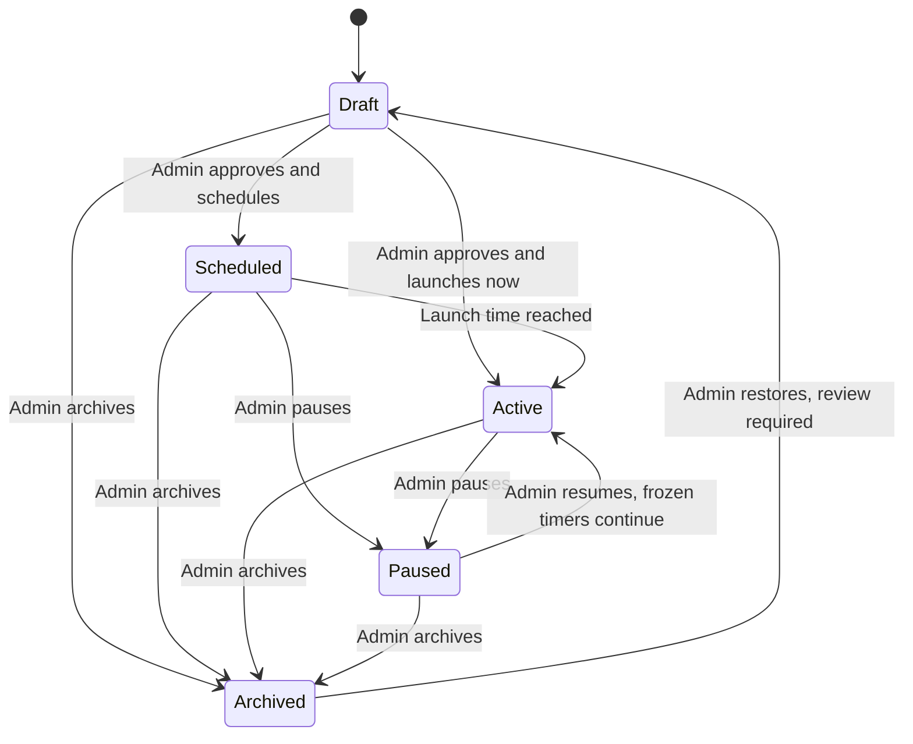

# Diagram 1: End-to-End User Flow

**Status:** First draft for review. This is the overview map; focused diagrams will detail campaign state, Gmail processing, workflow execution, and job operations.

**Source documents:** [User journeys](../user-journeys.md), [Campaign dashboard](../campaign-dashboard.md), [Reporting and data export](../reporting-and-data-export.md).

## Flow

```mermaid
flowchart TD
    Login[User signs in] --> Home[Role-aware home]
    Home --> Choice{Choose an action}
    Choice -->|Create campaign| Source{Choose lead source}
    Choice -->|Review or manage| CampaignDashboard[Open campaign dashboard]

    Source -->|Website or shareable link| WebSetup[Agent drafts form and workflow from business context]
    WebSetup --> WebReview[User reviews form, fields, destination, and follow-up]
    WebReview --> Summary[Agent presents complete campaign summary]

    Source -->|Gmail| GoogleAuth[Authorize read-only Gmail access]
    GoogleAuth --> Scope[Choose one Gmail acquisition account and mailbox scope]
    Scope --> Match[Set case-insensitive phrases and AND/OR logic]
    Match --> Mapping[Map email content to lead fields]
    Mapping --> Sample[Preview a selected Gmail email or pasted subject/body sample]
    Sample --> Summary

    Summary --> AdminApproval{Admin approves final summary?}
    AdminApproval -->|Revise| WebReview
    AdminApproval -->|Not yet| Draft[Keep as draft]
    AdminApproval -->|Approve| Launch{Launch choice}
    Launch -->|Now| Active[Campaign active]
    Launch -->|Schedule| Scheduled[Campaign scheduled]
    Scheduled --> Active

    Active --> Intake{Campaign source event}
    Intake -->|Website submission| WebLead[Create lead with campaign/source reference]
    Intake -->|Gmail message| MessageId{Message already processed?}
    MessageId -->|Yes| Suppress[Suppress repeated message using account + Gmail message ID]
    MessageId -->|No| RuleMatch{Message matches campaign rules?}
    RuleMatch -->|No| Ignore[Do not create a lead]
    RuleMatch -->|Yes| Extract[Extract values into confirmed lead-field mappings]
    Extract --> IntakeMode{Gmail intake mode}
    IntakeMode -->|Supervised default| Review[Create proposed item in Intake Review]
    IntakeMode -->|Admin-enabled automatic| LeadCreate[Create lead using configured mapping]

    Review --> FieldCheck{Missing/uncertain values or possible contact duplicate?}
    FieldCheck -->|Missing or uncertain| Correct[Reviewer edits missing or uncertain values]
    FieldCheck -->|Possible contact duplicate| DupAction{Reviewer chooses disposition}
    FieldCheck -->|No issue| ApproveLead[Reviewer approves]
    DupAction -->|Update/link existing| UpdateExisting[Update or link to existing lead]
    DupAction -->|Create separately| SeparateLead[Create a separate lead]
    DupAction -->|Dismiss| Dismiss[Dismiss proposed item]
    Correct --> ApproveLead
    UpdateExisting --> ExistingLead[Existing lead record, follow-up workflow behavior TBD]
    SeparateLead --> LeadCreate
    ApproveLead --> LeadCreate

    WebLead --> Workflow[Run configured campaign-level workflow]
    LeadCreate --> Workflow
    Workflow --> Assign[Assign by selected campaign rule]
    Workflow --> Notify[Notify selected team by in-app and/or email]
    Workflow --> Route[Keep in SalesMora, route to connected system, or both]
    Workflow --> Followup[Run configured follow-up steps]

    Followup --> Task[Create assigned human task]
    Followup --> Email[Send or queue branded email through shared SMTP]
    Email --> EmailMode{Email mode}
    EmailMode -->|Automatic, authorized| SMTP[Send from SalesMora no-reply identity]
    EmailMode -->|Human review| ReviewEmail[Lead owner or selected reviewer edits/sends, reschedules, or skips]
    ReviewEmail --> SMTP
    SMTP --> Inbound{Matching email arrives in connected Gmail?}
    Inbound -->|Exact sender email matches lead| StopSeq[Pause remaining email steps and notify owner]
    Inbound -->|No match| NextStep[Wait until next step timing/send window]
    NextStep --> Followup

    LeadCreate --> Pipeline[Lead moves through pipeline]
    Pipeline --> Lost{Marked Lost/Closed?}
    Lost -->|Yes| StopSeq
    Pipeline --> JobStage{Reaches campaign-selected job stage?}
    JobStage -->|Yes| Job[Create job with configured assignment and deadline]
    Job --> JobOps[Track status, team, deadline reminders, and updates]
    JobOps --> StopSeq
    JobStage -->|No| Pipeline

    Active --> CampaignDashboard
    CampaignDashboard --> Reports[View captured, review, approved, job, and follow-up metrics]
    Reports --> Export[Export authorized Phase 1 CRM data as CSV]
```

## Lifecycle controls (overview)

Archiving stops campaign intake and future automation while preserving leads, jobs, and audit history. A paused website campaign displays a customizable unavailable message. Paused Gmail intake retains messages for processing after resume.

## Rules intentionally deferred to focused diagrams

- Exact Gmail matching, sample preview, field-mapping, missing-field, and duplicate-review logic.
- Workflow timers, email review queue behavior, pause/resume, reminders, and SMTP failure/retry handling.
- Connector authorization, entitlement checks, idempotency, and delivery errors.
- Role permissions, subscription limits, and campaign dashboard metric definitions.
