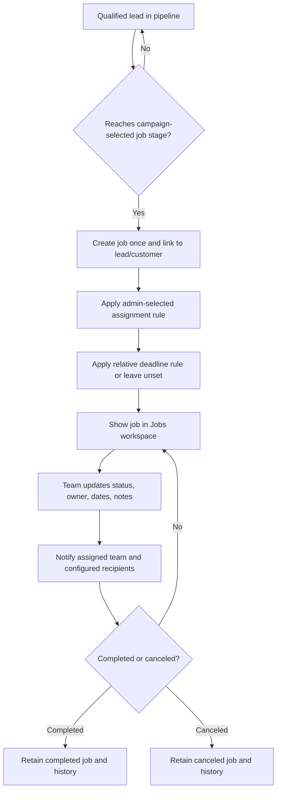

# SalesMora Job Module Plan

**Status:** Working product plan for review. Confirmed requirements from the user journeys are separated from proposed design choices and open questions.

## 1. Purpose

Give a small service business one reliable place to monitor work after a qualified lead becomes a job. The module should make it easy to see what is active, who owns each job, what stage it is in, and what deadlines or updates need attention.

The job record should preserve the context that led to the work: customer, source lead, requested service, campaign, and relevant activity. In the MVP, customer contact details are fields on the customer record rather than a separate contact entity. The module should remain useful for a one-person operator while supporting a growing office and field team.

## 2. Goals

- Convert a lead into a job at a pipeline stage chosen by the business.
- Use the default lead stages **New**, **Contacted**, **Estimate sent**, and **Won**, plus **Lost** as a closed outcome. **Won** is the default lead-to-job conversion stage; job progress is tracked with job statuses after conversion.
- Support job assignment, status/progress tracking, and deadlines.
- Make active, waiting, overdue, unassigned, and recently changed jobs easy to find.
- Notify the assigned team about relevant assignment, status, and deadline events.
- Keep an auditable activity history connected to the lead/customer context.
- Treat saved job progress notes as immutable. Correct an inaccurate note by adding a new note that explains the correction; do not edit or delete the original.
- Provide a path from job monitoring into later scheduling, estimates, and modular integrations without requiring them for the first useful version.

## 3. Confirmed requirements

### Workspace roles and job access

Use **Owner**, **Admin**, and **Member** as permission roles. **Office** and **Field** are work profiles for home-screen presentation only; they do not grant additional access. Organization Owners and Admins can access and manage business-wide job data. Members can access jobs assigned to them and perform permitted day-to-day updates. A work profile must never bypass these role and assignment checks.

- A campaign admin chooses the pipeline stage that converts a lead into a job. Reaching that stage creates the job; lead approval alone does not.
- Default the conversion stage to **Won**. The MVP uses the fixed lead stages **New**, **Contacted**, **Estimate sent**, **Won**, and **Lost**; do not allow stage renaming, reordering, or additions in the MVP.
- Users can also create a job manually without a lead, for example for a repeat customer or direct call. Link the customer; the source lead is optional.
- Manual job creation should happen through an agent conversation. The minimum required details are a customer and job title; collect other details only when the user wants to provide them.
- The agent searches existing customers before linking one. If there are multiple plausible matches, ask the user to select; if none is found, offer to create a customer inline.
- When creating a customer inline, require only a customer name; phone and email are optional.
- Before saving, show a concise summary of the customer, job title, and any supplied details. Let the user edit or confirm creation.
- Job assignment is part of the job-creation setup. The admin chooses the assignment rule, including assigning to the lead owner or a specific team member.
- Track the scheduled work date separately from the completion deadline: the scheduled date is when the team plans to do the work; the deadline is when the work should be finished.
- Support job file attachments in Phase 1 using private object storage, with tenant- and job-level authorization for every upload and download.
- Before removing an attachment, show a direct confirmation dialog naming the document and stating that removal is permanent and it cannot be recovered. Delete it only after explicit confirmation.
- When work scope changes significantly, let an authorized user create a separate follow-on job linked to the original so each job retains its own status and activity history.
- Let a scheduled work date include an optional arrival-time window (for example, 9–11 AM), rather than requiring an exact appointment time.
- Campaigns can set a relative deadline (for example, 14 days after job creation) or leave it unset. An authorized user can enter or change the deadline on an individual job; a single fixed calendar date is not applied to every job in a campaign.
- For relative deadlines, let the admin choose calendar days or business days; default to business days.
- Count business days as Monday through Friday; holiday calendars are not part of this rule.
- Default job statuses are **Needs Scheduling**, **Scheduled**, **In Progress**, **Waiting**, **Completed**, and **Canceled**. New jobs start in **Needs Scheduling**. Admins can customize statuses.
- When a scheduled date is saved, automatically move the job from **Needs Scheduling** to **Scheduled**.
- If the scheduled date is removed while a job is **Scheduled**, automatically return it to **Needs Scheduling**.
- Changes to **In Progress**, **Waiting**, **Completed**, or **Canceled** are made explicitly by an authorized team member.
- Automatically record the time and actor for each status transition, including entering **In Progress**, **Completed**, and **Canceled**. Reopening adds a new history event without erasing prior completion/cancellation history.
- When a job moves to **Waiting**, ask why it is blocked. Initial reasons are waiting on the customer, materials, approval, or another reason; allow an optional note.
- When a job leaves **Waiting**, do not require or prompt for a resolution note. Keep the original waiting reason on its history event and record the new status as a separate event.
- When a job moves to **Canceled**, require a reason: customer canceled, unable to proceed, duplicate/created in error, or other. Allow an optional note.
- Before saving a transition to **Canceled**, show the selected reason and optional note for confirmation. An agent-proposed cancellation also requires the user to confirm.
- Reopening a **Completed** or **Canceled** job requires confirmation and offers an optional note explaining why work resumed. Preserve the prior close event and record reopening as a new status-history event.
- Make the job team chat read-only while the job is **Completed** or **Canceled**. Reopening the job restores chat participation; preserve the chat history throughout.
- Before saving a transition to **Completed**, show a brief confirmation with an optional completion note. An agent-proposed completion also requires the user to confirm.
- Do not permanently delete saved jobs. Use **Canceled** with the appropriate reason, including **duplicate/created in error**, so the job and its audit history remain available in the closed-jobs view.
- Job notification triggers include lead-to-job creation, status changes, assignment changes, scheduled-date changes, completion-deadline changes, approaching deadlines, and overdue deadlines.
- Notifications go to the assigned job team by default. Admins can add other team members, including themselves.
- Initial notification channels are in-app and email. SMS is a later feature.
- Admins can configure multiple deadline reminder offsets, including chosen days before or after the deadline and reminders on the due date.
- The Jobs workspace's **Deadlines coming up** group uses those configured offsets rather than a separate fixed time window.
- A job created from a lead stops that lead's campaign follow-up sequence.
- Organization Owners/Admins can view and manage all jobs and configure business-wide job rules. Members can view assigned jobs and update permitted progress, Waiting reasons, and notes, but cannot reassign jobs or change business-wide settings. Office/Field work profiles do not change this access.
- Only the job's primary owner and organization Owners/Admins can set, change, or remove its completion deadline.
- Only the job's primary owner and organization Owners/Admins can set, change, or remove its scheduled work date or arrival window.
- A saved progress note cannot be edited or deleted by its author or an administrator. Keep the original actor and timestamp; corrections are additional notes in the activity history.

### Subscription availability

- Include core job management on every subscription plan: job records, board/table views, assignments, status and activity history, basic job counts and CSV export, and the Phase 1 attachment and optional-deadline capabilities.
- Do not cap the number of active jobs by subscription tier.
- Set attachment storage quotas by subscription tier and show organization storage usage: 1 GB on Free, 10 GB on Standard, and 50 GB on Premium.
- At the attachment quota, keep existing files accessible and allow deletion, but pause new uploads until the organization frees space or upgrades its plan.
- Apply the same behavior after a downgrade that leaves the organization over its new quota: retain existing file access and pause new uploads until usage is under the limit or the organization upgrades again.
- Warn the organization at 80% and again at 100% of its attachment storage quota.
- Send quota warnings to all organization owners and admins through in-app and email notifications.
- Gate advanced workflow automation, configurable multi-offset reminders, expanded team notification controls, and advanced operational reporting to Premium.
- Retain existing job records and attachments after a downgrade while applying plan limits to future usage.

## 4. Proposed information architecture

### Jobs workspace

The primary Jobs area should open to a movable status board, with:

- Job cards grouped into columns for the configured statuses.
- Show active statuses by default; make **Completed** and **Canceled** jobs available in a separate closed-jobs view/filter.
- Each card shows the job title, customer, primary owner, scheduled date or deadline, and a Waiting reason when applicable.
- Dragging a card to another status column is an explicit status change and records history and triggers configured notifications.
- If a card is moved to **Scheduled** without a scheduled date, prompt the user to set one before completing the move.
- A compact attention area for overdue deadlines, deadlines due soon, unassigned jobs, and jobs in **Waiting**, with direct links to each job.
- Search and filters for status, assignee/team member, deadline, customer, service type, and date created.
- Quick links to a job's customer, source lead, activity history, and related campaign when present.
- Show links to related follow-on jobs and the originating job when applicable; keep each job's assignments, dates, status, and history independent.
- A clear action to start conversational job creation.

Offer both a movable status board and a sortable table view. The board is the default; the table is an alternate view for users who need to scan, sort, and compare many jobs at once. Keep search, filters, and role permissions consistent between both views.

### Job detail

Phase 1 uses one scrollable job detail page, with the sections below in a consistent order and the newest activity visible without switching tabs. Each job page also has an always-available, text-only, job-scoped team chat with the agent, alongside direct controls. Current job team members can see the conversation; confirmed job changes and saved progress notes also appear in the separate Activity history. Chat file uploads and @mentions are deferred to later phases. In Phase 2, offer alternate card and list layouts for the job detail sections. Each user chooses and saves their own preference, which applies across jobs; this is separate from the Jobs workspace board/table choice.

Proposed sections on a job record:

1. **Summary:** Job name/number, customer, service/location, current status, primary assignee/team, and deadline.
2. **Progress:** Status history and the current next action or blocked reason, if supplied by the team.
3. **Team:** Primary assignee and any additional participants, with reassignment controls governed by role permissions.
4. **Dates:** Created date, scheduled dates when supported, deadline, and reminders.
5. **Related records:** Source lead, customer, campaign, and estimate/schedule records when those features exist.
6. **Files:** Job attachments with filename, file type, size, uploader, and upload time; download access is checked against current job permissions. The uploader (while still authorized) and organization Owners/Admins may remove an attachment. Removing a file requires a dialog such as: **“Permanently delete ‘[filename]’? This document will be lost forever and cannot be recovered.”** The user must choose **Delete permanently** to continue.
7. **Activity:** A single chronological history of status/assignment changes, notes, reminders, file upload/removal events, and important workflow events. Open newest-first, with older entries available by scrolling. Phase 1 has no event-type filters; add them later if long histories become difficult to scan.

Keep job data entered by the team separate from immutable event history so that updates do not erase who changed a job or when.

## 5. Job lifecycle

Create the job idempotently when the lead reaches the configured stage. Repeated events, retries, or moving a lead back and forth across stages must not silently create duplicate jobs. An authorized user can reopen completed or canceled work; before reminders restart, the user confirms or updates the previous deadline.

## 6. Status and progress tracking

### Initial status set

| Status | Example use |
|---|---|
| Needs Scheduling | Job has been created but no work date has been arranged |
| Scheduled | Work has a planned date |
| In Progress | The team is actively doing the work |
| Waiting | Work is blocked on a customer, material, approval, or other dependency |
| Completed | Work is finished |
| Canceled | Work will not proceed |

Admins can customize the status names to fit their business. A structured waiting reason makes blocked jobs easier to monitor; an optional note adds detail without forcing a long form. Cancellation requires one of the agreed reasons and may include an optional note.

Every status change records the previous and new status, actor, timestamp, and optional note. For the initial version, allow any status to be selected without admin-configured transition restrictions. Admins can customize status names; configurable transition rules and status colors remain future considerations.

## 7. Assignment and team coordination

At job creation, apply the rule selected by the campaign/business configuration:

- Assign to the lead owner.
- Assign to a specific team member.
- Preserve the option for an authorized admin to change the assignee on the job.

Use one primary owner for clear accountability, with optional additional team members. The campaign/business rule chooses the primary owner; campaigns can preselect default additional team members, and users can adjust the team per job. For manual jobs, use the business-wide job assignment rule when the user does not name an owner. If no rule exists, have the agent ask the user to choose an owner rather than silently assigning the creator.

When the primary owner changes, remove the previous owner from the job team by default while keeping existing optional team members assigned. This ends the previous owner's job-based access and future job notifications; organization-wide access held by an Owner/Admin still applies. Preserve the previous assignment in job history. Every assignment or reassignment records who changed it and when. Notify the previous and new assignee, plus configured recipients, according to notification preferences. Avoid sending duplicate alerts when the same assignment is replayed by a retry.

When an optional team member is removed, send one final in-app and email notice that they were removed from the job, then end their job-based access and future job notifications. Retain the assignment history. Organization-wide access held by an Owner/Admin still applies.

## 8. Deadlines and reminders

### Deadline setup

The scheduled work date and completion deadline are separate job fields. The scheduled date moves a job from **Needs Scheduling** to **Scheduled** and may include an optional arrival window; deadline reminders are based on the completion deadline.

Support these deadline setup modes:

- **Relative:** A campaign or business rule sets a deadline a chosen interval after job creation.
- **Per job:** Leave the deadline unset by default until an authorized user enters it on the job. A campaign may also choose not to set a deadline automatically.

Do not apply one fixed calendar deadline across every job in a reusable campaign. Use a relative rule or leave the date unset for per-job entry.

### Reminder rules

- Let admins configure one or more offsets before the deadline, on the due date, and after it.
- Notify the assigned job team by default; allow admins to include other members and themselves.
- Allow both in-app and email notifications; email uses SalesMora's Resend account and no-reply identity.
- Recalculate or cancel pending reminders when the deadline changes.
- When an authorized user sets, changes, or removes a completion deadline, immediately notify the assigned team in-app and by email; recalculate or cancel pending reminders to match the new deadline.
- Stop pending deadline reminders once the job is Completed or Canceled, while retaining reminder history.
- Allow an authorized user to reopen a Completed or Canceled job and choose its active status; record the reopening in job history.
- When reopening, show the previous deadline and require the user to confirm or update it before restarting reminders.
- Reopening a job preserves its existing checklist steps and checkmarks; the job owner can adjust the checklist for resumed work.
- Use the business timezone for the time of day associated with reminders. Exact send-time settings should align with the notification scheduling controls.

## 9. Notifications and event rules

| Event | Confirmed recipient behavior | Initial channel |
|---|---|---|
| Lead converted to job | Assigned job team by default; admin may add recipients | In-app and email, immediately |
| Job status changes | Assigned job team; admin may add recipients | In-app and email |
| Assignment changes | Assigned job team; admin may add recipients | In-app and email |
| Job team chat message | Other current job team members, excluding the sender | In-app; no email |
| Scheduled date or arrival-window changes | Assigned job team; admin may add recipients | In-app and email, immediately |
| Completion deadline set, changed, or removed | Assigned job team; admin may add recipients | In-app and email, immediately |
| Deadline approaching | Assigned job team; admin may add recipients | In-app and email |
| Deadline overdue | Assigned job team; admin may add recipients | In-app and email |

The business configures the reminder offsets for approaching and overdue deadlines. Notifications should link directly to the job and explain the event without exposing information to unauthorized users. SMS is deferred.

Proactive agent-authored reminders in job chat are deferred to a future release; phase and plan-tier placement remain undecided. Phase 1 deadline reminders use the existing in-app/email notification rules, and the agent responds in chat when asked.

## 10. Agent assistance

The agent can reduce setup work and help teams keep jobs current, while preserving human control over consequential changes:

- Make natural-language assistance the primary path for common job actions when practical, while keeping direct controls available. Agent actions must use the same authorization, validation, audit-history, and notification rules as direct actions.
- Keep the job-scoped agent conversation available from anywhere on the job detail page as a team-visible chat. Current job team members can see prior messages; removing a member ends their job-based access to the chat. The agent may help with authorized job edits, attachments, notes, scheduling, deadlines, and status changes; it must confirm consequential changes before saving.
- In Phase 1, respond to user requests in job chat; do not proactively post deadline reminders there. Use the configured notification system for deadline and status reminders. Proactive agent-authored chat reminders are a future-release candidate.
- Help users add job attachments by opening the same file picker or mobile camera flow available from the Files section, then guide them through review and upload.
- Suggest a job title, service type, location, and summary from the approved lead and campaign context.
- Draft a job checklist or next-step recommendations for a user to review (release phase TBD).
- Summarize job history and surface missing assignee/deadline/status information.
- Recommend a status update based on user-provided notes, but require confirmation before changing the job status or notifying the team.
- Help an admin define job reminders and assignment rules in plain language, then show a reviewable summary before activation.

The agent must not invent agreed pricing, confirm a schedule with a customer, or send customer communications without explicit authorization. Any approved system-generated email uses Resend through SalesMora, not Gmail.

## 11. Reporting and exports

The Phase 1 reporting plan already proposes job counts by status and assignee, jobs created over time, and drill-through to jobs. The Phase 1 export plan includes jobs and CRM activity history as CSV datasets. The job module should link to those shared reports rather than create separate incompatible metric definitions.

Later reporting can add deadline adherence, time spent in each status, scheduled capacity, estimates-to-completion, and job profitability once the necessary scheduling, estimate, and financial data exists.

## 12. Data and technical outline

Keep PostgreSQL as the system of record and use Knex for schema migrations. Tenant-scope every job query and write.

Use a private Railway Storage Bucket as the Phase 1 attachment store. Keep attachment metadata and tenant/job ownership in PostgreSQL; do not store uploads on a Railway service filesystem or in PostgreSQL byte columns. Authorize the user and job before issuing a short-lived presigned upload or download URL; generate opaque object keys server-side and never expose bucket credentials to the browser. Enforce a maximum size of 10 MB per file and validate allowed file types; verify uploaded object metadata before marking an attachment ready, and do not permit downloads until any configured malware scan marks the file clean. Before removing a file, show a confirmation dialog naming the document and warning that it will be permanently lost. After confirmation, immediately make it unavailable, destroy its per-file encryption key so copies are unrecoverable, and permanently delete the object and any recoverable copies; retain only non-content audit metadata. Record upload, download, and removal events. Any disaster-recovery process must apply confirmed deletion records so restored data cannot resurrect removed files.

Railway Storage Buckets use HTTPS endpoints and are private, but Railway's current documentation lists server-side encryption, object versioning, object locks, and bucket lifecycle configuration as unsupported. Use application-level envelope encryption for sensitive customer/job documents, with keys managed outside the bucket; do not claim the provider encrypts stored objects at rest. Maintain daily encrypted disaster-recovery copies of active attachments in a separate private Railway bucket and retain those recovery copies for 30 days. Target an attachment recovery point objective (RPO) of 24 hours and a recovery time objective (RTO) of one business day; treat these as targets to validate in restore drills. A user-confirmed deletion must destroy the per-file encryption key immediately, record a durable deletion tombstone, and remove the active object; any backup ciphertext must be unrecoverable immediately and physically purged under the deletion process. Restore procedures must apply deletion tombstones before recovered files can be accessed. Do not apply a recovery window to intentional deletions. Keep staging and production buckets separate, restrict credential references to the web/worker services that need them, and rotate credentials after suspected exposure.

Proposed core records and relationships:

- `jobs`: organization, customer, originating lead/campaign, title/description, status, service/location, deadline and schedule fields, created/updated metadata.
- `job_assignments`: job, team member, role (primary/additional), assignment actor, and timestamps.
- `job_status_history`: job, previous/new status, actor, timestamp, optional reason/note.
- `job_activity`: job-linked notes and significant events, or a shared polymorphic activity model if that already exists.
- `job_attachments`: tenant and job IDs, opaque storage key, original display filename, detected content type, byte size, uploader, upload/scan state, and timestamps. Store file bytes in private object storage, never in PostgreSQL or the application filesystem.
- `job_activity_attachments`: links an attachment to the immutable progress-note activity event it was added with; the same attachment remains listed in the job's Files section. Removing an attachment preserves the note and records that the linked file was removed.
- `job_chat_messages`: immutable job-scoped user and agent messages in the shared team chat, visible only to currently authorized job members and roles with organization-wide access. Corrections are new messages, not edits or deletions.
- `job_chat_read_cursors`: per-user last-read position for each job chat, used for that user's unread indicator. Do not expose read receipts or individual read state to other team members.
- `job_checklists`: zero or one optional checklist per job (enforce a unique job ID), with draft/active state, agent-generation metadata, and approval actor/time.
- `job_checklist_items`: checklist ID, simple step label, display order, done/not-done state, completion actor/time, and change timestamps. Log item creation, edit, removal, completion, and reversal in job activity.
- `job_reminder_rules` and `job_reminder_executions`: configured offsets and idempotent delivery state, if reminder configuration is not represented by the general workflow engine.
- `workflow_executions`/outbox events: durable triggers, retries, idempotency keys, and notification outcomes using the common workflow infrastructure.

Prefer shared workflow/event infrastructure over a parallel job-only scheduler. Store searchable status, owner, deadline, customer, and organization fields relationally; add indexes based on observed query patterns. Keep custom or rarely queried job attributes extensible without moving core filters into opaque JSON.

## 13. Delivery phases

Phase 1 includes job file attachments and an optional completion deadline on each job, unset by default, with a basic due/overdue indicator and alert. Configurable multi-offset reminders and advanced notification controls remain in Phase 3:

| Phase | Job module scope |
|---|---|
| **1 — CRM foundation** | Job record, link from lead/customer, movable status board and sortable table, primary assignment, status and activity history, team-visible job chat with the agent, private job file attachments (including files attached while creating a progress note), optional per-job completion deadline (unset by default) with basic due/overdue indicator and alert, basic in-app notification, job counts and CSV export. |
| **2 — Workflow automation and extensions** | Campaign-configured lead-to-job stage conversion, workflow-triggered job creation, per-job checklists made of simple named steps with a done/not-done state (no per-item assignee or due date), linking an existing job attachment to a progress note after the note has been saved, and alternate card/list layouts for the job detail page. |
| **3 — Operations** | Configurable multi-offset deadline reminders, expanded team email notification rules, richer progress controls, calendar/scheduling integration, and operational reports. |
| **4 — Expansion** | Estimates/accounting integration, advanced job templates, capacity and profitability reports, and validated AI-assisted job operations. |

Phase 2 supports zero or one optional checklist per job. A job can have no checklist, and an empty checklist does not block job creation or checklist approval.

## 14. Success criteria

- A qualified lead reaching its configured campaign stage creates exactly one linked job.
- An authorized admin can configure the agreed assignment and deadline behavior.
- Teams can find jobs by status and assignee, open the source lead/customer context, and update status with a recorded history.
- Status and assignment changes notify the configured recipients using in-app/email channels without duplicate alerts.
- The Phase 1 deadline can be left unset, and a populated deadline is visibly identified as due or overdue. Later configured reminders respect the business timezone and stop or recalculate when a job changes as defined by the final rules.
- Users without access to a job or organization cannot view it through the UI, report, notification link, or export.
- A completed/canceled job remains available with its history and cannot receive ordinary active-work reminders.
- Job files are stored outside PostgreSQL, remain private, and can only be uploaded or downloaded by a currently authorized member of the job's organization.
- Removing a file requires a clear, explicit confirmation; after confirmation, the document and recoverable copies are permanently unavailable, while non-content audit metadata remains.

## 15. Open decisions

- Subscription prices and core quotas are provisionally defined in the product roadmap; validate them before billing launch. Active jobs and existing CRM history are not capped by plan. Attachment storage limits and behavior are specified in Section 4; do not add other job-specific entitlement limits without a product decision.

## 16. Detailed user journey walkthrough

This walkthrough turns the confirmed job rules into the user-facing sequence. It will be expanded one step at a time as the flow is reviewed.

### Step 1 — Open the Jobs workspace

1. The user selects **Jobs** from the main navigation.
2. The workspace opens to the active status board by default. The user can switch to the sortable table view.
3. Organization Owners/Admins see all business jobs. Members see jobs assigned to them. Office/Field work profiles may change the view's priorities but do not widen record access.
4. The workspace shows the attention groups for overdue/upcoming deadlines, unassigned jobs, and jobs in **Waiting**, with links to the affected records.
5. **Completed** and **Canceled** jobs stay out of the default active board and are available through the closed-jobs view or filter.
6. An authorized user can open a job card/row or start a conversational manual job creation flow. The user can also start job creation from a customer profile, with that customer preselected.

**Step 1 confirmed behavior:** the board is the default, with a table alternative and role-aware visibility. The next step begins when the user chooses to create a manual job; campaign-triggered job creation follows a separate entry path.

## 17. Journeys inside a job

This section details the actions a user can take after opening a job, including what they may edit, the interaction pattern, and the resulting history/notifications. Add each subjourney as it is reviewed.

### In-job journey 1 — Edit core job details

1. The job's primary owner or an organization Owner/Admin can open **Edit details** on the job page, or ask the agent to change details in natural language.
2. They can update the job title, description, service, and location. Other Members do not edit these core fields by default; assigned Members can update permitted progress and notes.
3. The direct editor presents current values with clear **Save** and **Cancel** actions. The agent summarizes the proposed field changes and asks for confirmation before saving. Invalid values are identified; canceling discards the unsaved changes.
4. On save, the updated values appear on the job detail page and job cards/table rows that show those fields. Add an activity event with the editor, timestamp, and changed fields, regardless of whether the direct editor or agent was used.

### In-job journey 2 — Attach images and documents

1. An authorized job team member selects **Add attachment** in the Files section or asks the agent to add a file. The agent opens the same file picker or mobile camera flow.
2. The user can add multiple files in one action. On desktop, use drag-and-drop or a file picker; on mobile, allow choosing existing images/files or taking a new photo with the camera.
3. Before upload, show the selected filenames, types, and sizes and let the user remove items from the upload queue.
4. Let the user add an optional short description for each file, such as “before repair” or “replacement part label.”
5. Validate each file against the Phase 1 type/size limits and the organization's remaining storage quota. Show per-file upload progress and results.
6. Successful files appear in the Files list with the description when present; failed files show a clear reason and a retry action. Uploads are recorded in job activity.
7. Adding an attachment does not notify the assigned team by default; the upload is visible in the job activity feed. Configurable attachment notifications can be considered with the later expanded notification controls.
8. Phase 1 accepts JPEG, PNG, HEIC, and WebP images, plus PDF, DOCX, XLSX, and TXT documents. Reject archive and executable file types.
9. Limit each attachment to 10 MB; show the limit before the user selects or uploads files, and explain when an individual file exceeds it.
10. Show in-app previews for images and PDFs. Other supported document types download for viewing. Re-check job authorization before serving a preview or download and record downloads in activity.
11. The uploader, while still authorized to access the job, and organization Owners/Admins can edit an attachment description after upload. Save the change to activity history with the editor, timestamp, and changed description.
12. The uploader, while still authorized to access the job, and organization Owners/Admins can permanently remove an attachment. Before deletion, require the irreversible confirmation dialog naming the document and stating it will be lost forever; after confirmation, make it unavailable, destroy its per-file encryption key, and retain only non-content audit metadata.

### In-job journey 3 — Add a progress note

1. An assigned job team member starts a progress update through the job conversation or selects **Add note**.
2. The user describes the work performed, an observation, or a blocker in their own words. The agent may help turn the text into a concise note but must show the final note before saving it.
3. In Phase 1, the user may attach photos or documents while creating the note, using the file picker or mobile camera flow. Apply the same type, size, quota, authorization, and upload rules as other job attachments; show the files alongside the note in its final review. Linking an already-uploaded file to a note after the note is saved is a Phase 2 capability; that later link is a separate timestamped activity event and does not edit the original note.
4. Saving creates a timestamped activity entry attributed to the user and links the uploaded files to that note. The files also appear in the job's Files section. A progress note does not change the job status unless the user separately requests and confirms a status change.
5. Saved notes are immutable and cannot be edited or deleted, including by admins. To correct a mistake, add a new note that identifies the correction; preserve both entries in chronological history.
6. If a linked attachment is later removed under the irreversible-deletion rule, preserve the note and its history, and show that the linked file was removed.
7. Adding a note is recorded in job activity only; it does not send a notification. Status-change notifications follow their separate campaign/business notification rules.

### In-job journey 4 — Change the primary owner

1. An organization Owner/Admin opens the Team section and selects **Change owner**.
2. They select a new primary owner from active organization members and review the change before saving.
3. On save, the new person becomes the primary owner and the previous owner is removed from the job team. This ends the previous owner's job-based access and future notifications; organization Owners/Admins retain organization-wide access through their role.
4. Keep existing optional team members assigned. Record the previous and new owner, the actor, and the timestamp in assignment history. Send the assignment-change notification to the previous and new owner and any configured recipients; do not send future job notifications to the previous owner unless they are separately added back to the job.

### In-job journey 5 — Manage optional team members

1. An organization Owner/Admin opens the Team section and selects **Manage team**.
2. They can add active organization members as optional participants or remove current participants. Review the changes before saving.
3. Adding a member gives them job-based access and future job notifications, with an in-app and email notice that they were added. When removing a member, send one final in-app and email notice that they were removed, then end their job-based access and future notifications; organization Owners/Admins retain organization-wide access through their role.
4. Record each addition and removal with the actor and timestamp in assignment history. Removed members remain visible in historical assignment records but cannot open the job through job-based access.

### In-job journey 6 — Schedule or reschedule work

1. The job's primary owner or an organization Owner/Admin starts a scheduling conversation from the job detail page and tells the agent the new work date and, optionally, an arrival-time window.
2. The agent shows the current schedule and proposed change, then asks the user to confirm before saving. The user can correct the proposal or cancel.
3. On confirmation, save the scheduled date and optional arrival window, recording the actor, timestamp, and prior/new values in job activity.
4. Setting a date on a job in **Needs Scheduling** moves it to **Scheduled**. Removing the scheduled date from a job in **Scheduled** returns it to **Needs Scheduling**.
5. Notify the assigned team immediately in-app and by email when the scheduled date or arrival window changes. The agent does not contact the customer; any customer communication happens outside SalesMora.

### In-job journey 7 — Change the completion deadline

1. The job's primary owner or an organization Owner/Admin starts a deadline conversation from the job detail page and asks to set, change, or remove the completion deadline.
2. The agent shows the current deadline and proposes the requested new date or no-deadline state. The user can correct the proposal or cancel.
3. On confirmation, save the deadline change and record the actor, timestamp, and previous/new values in job activity.
4. Immediately notify the assigned team in-app and by email. Recalculate pending reminders against the new deadline or cancel them if the deadline is removed.
5. If the job is completed or canceled, do not restart reminders unless the job is reopened and an active deadline is confirmed.

### In-job journey 8 — Use job team chat and the agent

1. The user opens the persistent Chat area from anywhere on the job detail page. The conversation is scoped to that job and visible to its current job team and users with organization-wide access.
2. A team member can send text messages to other participants or ask the agent to help with an authorized job action. Show messages in chronological order, with the newest at the bottom. Phase 1 chat does not accept file uploads or @mentions; users add files through the Files section or with a progress note. The agent uses the job context and current permissions.
3. Post user and agent messages in the shared chat. Notify other current job team members in-app for each new message; do not send email for ordinary chat messages and do not notify the sender. Show each user their own unread-message indicator, without exposing read receipts to teammates.
4. For an action that changes job data or sends an approved notification, the agent summarizes the proposed action and asks the user to confirm. On confirmation, record the change in the appropriate job history or Activity feed; chat messages remain in the chat thread.
5. Sent user and agent messages are immutable and cannot be edited or deleted. Correct a mistake with a follow-up message while retaining the original in the thread.
6. Make chat read-only when the job is **Completed** or **Canceled**. Reopening the job allows messages again; preserve chat history.
7. Removing a person from the job team ends their job-based access to the chat, as well as future job notifications. Keep the conversation available to the remaining authorized team members.

### In-job journey 9 — Use a job checklist (Phase 2)

1. For a manually created job, the agent drafts the job's one optional checklist of simple named steps from the job details.
2. Before saving the checklist, the primary job owner or an organization Owner/Admin reviews the draft and can add, remove, or edit steps. They may also skip the checklist or approve it empty; job creation does not depend on checklist approval.
3. The job detail page shows approved checklist steps with a done/not-done state. Checklist steps do not have their own assignee or due date.
4. The primary job owner and organization Owners/Admins can add, edit, reorder, or remove checklist steps after approval, including removing all steps.
5. Assigned team members can mark checklist steps complete or uncheck a mistaken completion through the checkbox or by asking the agent. When acting through chat, the agent confirms the specific step before changing it. Record each change with the requesting user and timestamp in checklist/activity history; do not send a team notification for each change.
6. Completing all checklist steps does not change the overall job status. The job owner completes the job through the separate explicit **Completed** status flow.
7. Reopening a completed or canceled job preserves the checklist's existing steps and checkmarks. The job owner can make changes for the resumed work.
8. For a job created by automatic lead conversion, the agent drafts an optional checklist but does not activate it. The primary job owner can edit and approve the draft, even if they are not an organization admin, or skip it; the job itself is not held up waiting for checklist approval.

### Alternate entry path — Convert a lead into a job

1. The campaign admin chooses the lead stage that should create a job and configures the assignment rule, optional additional team members, and relative completion deadline or no deadline.
2. When the lead reaches that stage, the system creates exactly one job linked to the source lead, customer, and campaign, applies the configured assignment/deadline rules, and starts it in **Needs Scheduling** unless a scheduled date is supplied.
3. The agent drafts a checklist from available lead, campaign, and job details. Keep it pending until the job owner reviews and approves it; checklist review does not delay job creation.
4. The conversion is idempotent. Replayed events or moving the lead back and forth across stages do not create duplicate jobs.
5. Notify the assigned job team immediately in-app and by email that the new job is ready, including that a checklist draft is awaiting the job owner's review.
6. Creating the job stops that lead's campaign follow-up sequence. The job joins the same Jobs workspace and progress journey as a manually created job.

### Step 2 — Start manual job creation

1. The user selects the conversational **Create job** action from Jobs, or starts it from a customer profile.
2. From Jobs, the agent opens with: **“Who is the customer, and what work needs to be done?”** From a customer profile, it uses that customer and asks: **“What work needs to be done for [customer]?”**
3. The user may answer naturally, providing the customer and job description in either order or in one response. When started from the customer profile, the customer is already selected.
4. The agent extracts the minimum required details—customer and job title—and asks only for a required detail that is still missing. It should not turn the conversation into a long setup form.

### Step 3 — Find or create the customer

1. The agent searches the organization’s existing customer records using the customer information provided.
2. If there is one clear match, it links that customer to the draft job.
3. If multiple customers are plausible matches, it shows enough identifying information for the user to choose the right one.
4. If no match is found, the agent offers to create a customer inline. A name is required; phone and email are optional.
5. The agent keeps the job as a draft until required details are present and the user reviews the save summary.

### Step 4 — Capture optional job details

1. Once the customer and job title are known, the agent asks: **“Anything else you’d like to add?”**
2. The user can add context in their own words or skip this step.
3. The agent maps volunteered details into the corresponding job fields and asks a follow-up only when it needs to resolve an ambiguity. It does not require the user to fill out every optional field.

### Step 5 — Confirm the job owner and team

1. If the user named a primary owner, use that selection.
2. Otherwise, apply the business-wide manual-job assignment rule.
3. If there is no applicable assignment rule, ask the user to choose a primary owner; do not silently assign the creator.
4. Allow optional team members in addition to the single primary owner. An organization Owner/Admin can change assignments later.

### Step 6 — Review and save

1. The agent presents a concise review containing the customer, job title, any supplied details, primary owner, optional team members, initial status (**Needs Scheduling**), and any dates provided.
2. The user can correct the draft or confirm it.
3. On confirmation, the system creates the job and writes its creation and initial assignment to the activity history.

### Step 7 — Offer to schedule the work

1. After saving, the agent asks whether the user wants to schedule the work date now.
2. If the user says yes, the agent gathers a scheduled work date and may ask for an optional arrival-time window.
3. Saving a scheduled date moves the job from **Needs Scheduling** to **Scheduled**.
4. If the user says not now, leave the job in **Needs Scheduling**. The user can start a later scheduling conversation from the job.

### Step 8 — Offer an optional completion deadline

1. Keep the completion deadline distinct from the scheduled work date.
2. If a campaign/business rule has already set a relative deadline, show it in the job summary and let an authorized user change it.
3. Otherwise, the agent offers to set an optional completion deadline. The user can provide a date or skip; if skipped, leave the deadline unset.
4. When a deadline is present, show it on the job and use the configured basic due/overdue indicator. Premium reminder rules may add further notifications.

### Step 9 — Open the saved job

1. After the user completes or skips scheduling and deadline setup, open the new job's detail page.
2. Show the customer and job summary, current status, owner and team, scheduled date, deadline if set, files, and activity history.
3. Provide direct actions to schedule/update the job, change status, manage assignments (when permitted), and add attachments.

### Step 10 — Add and manage attachments

1. The user selects **Add attachment** and chooses a local file.
2. Show the organization's current storage use and plan allowance. Validate file type, file size, permissions, and remaining quota before accepting the upload.
3. Show upload progress and a clear success or failure result. A successful upload appears in the Files section with filename, type, size, uploader, and upload time; record the event in job activity. Do not notify the assigned team by default. Authorized team members can open/download the file, and downloads are recorded.
4. If the upload would exceed quota, keep existing files accessible and explain that the user must delete a file or upgrade the plan before uploading.
5. To remove a file, the user confirms the named document in the irreversible-deletion dialog. After confirmation, the file becomes unavailable and its encryption key is destroyed; keep only non-content audit metadata.
6. Only the uploader (while still authorized) and organization Owners/Admins can remove an attachment. Other authorized job team members can still view and download it.

### Step 11 — Update job progress

1. The user can change status from the job detail page or by moving the card on the Jobs board. Any status can be selected.
2. Entering **Waiting** requires a reason (customer, materials, approval, or other) and allows an optional note. Leaving **Waiting** does not prompt for a resolution note. Entering **Canceled** requires a cancellation reason and allows an optional note, followed by a confirmation showing the selected reason.
3. Before changing status to **Completed**, show a brief confirmation and allow an optional completion note. The agent must also confirm its proposed completion with the user.
4. Record the previous and new status, actor, timestamp, and any reason/note in job history; send configured notifications.
5. When a job becomes **Completed** or **Canceled**, stop pending deadline reminders while retaining history. If reopened, the user selects an active status, confirms the reopen with an optional note, and confirms or updates the prior deadline before reminders restart.

### Step 12 — Report progress through the agent

1. A user can describe progress naturally in the job conversation, for example: “We’re waiting on materials.”
2. The agent proposes the matching status and reason, showing the change it inferred.
3. The user confirms or edits the proposal before the agent updates the job.
4. After confirmation, record the status transition, actor, timestamp, and note/reason in history, then run the configured notification and reminder rules. The agent must not silently change status or send an unreviewed customer message.

### Step 13 — Add a note through the agent

1. The user can ask the agent to add a note without changing the job status.
2. Save the note to the job activity history with the requesting user and timestamp.
3. Show the saved note in the job's Activity section only; do not send a notification or treat a note as authorization to contact the customer.
4. Keep saved notes immutable. To correct one, add a separate note that explains the correction; retain the original author and timestamp.

### Step 14 — Receive job notifications

1. Status changes, assignment changes, scheduled-date changes, completion-deadline changes, approaching deadlines, and overdue deadlines trigger the configured job notifications.
2. Notify the assigned job team by default. An admin may add additional recipients, including themselves.
3. Deliver notifications in-app and by email; email uses SalesMora's Resend account and no-reply identity. SMS remains a later feature.
4. In-app notifications and status/assignment/schedule/deadline-change emails send immediately. Deadline reminder emails follow configured offsets before, on, or after the deadline and send at the admin-selected time in the business timezone. Premium supports configurable multi-offset rules.
5. Each notification links to the job and only includes information the recipient is authorized to see.

### Step 15 — Complete or cancel the job

1. An authorized team member explicitly changes the job status to **Completed** or **Canceled**.
2. For completion, show a brief confirmation and allow an optional completion note. For cancellation, require a reason, allow an optional note, and show both for confirmation before saving.
3. On confirmation, record the actor and timestamp; send configured status notifications.
4. The job leaves the active board and remains available in the closed-jobs view with its full history and files.
5. Stop pending deadline reminders when the job is completed or canceled.
6. If the job is reopened, show a confirmation with the selected active status and an optional note. Preserve the prior close event, add a new reopen event, and confirm or update the previous deadline before reminders restart.
7. Saved jobs cannot be permanently deleted. For duplicate jobs or jobs created in error, select **Canceled** and the matching reason; retain the job and its history.

### Step 16 — Create follow-on work when scope changes

1. If work needs a materially different scope, an authorized user creates a separate follow-on job linked to the original.
2. The new job gets its own title, owner/team, dates, status, attachments, and activity history; the original job remains unchanged.
3. The user continues through the normal review/save and job-management journey for the follow-on job.
