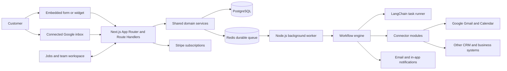
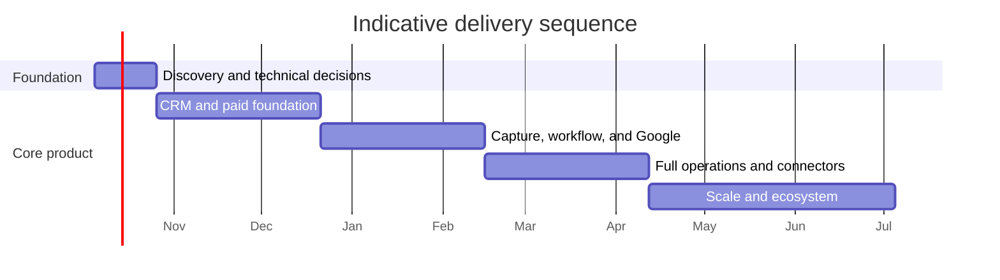

# SalesMora: Product and Delivery Roadmap

**Product domain:** [salesmora.ai](https://salesmora.ai)

## Summary

Build a US-first, subscription-based CRM for small and medium home-service businesses, starting with construction, plumbing, HVAC, electrical, and similar trades. The product connects lead capture to follow-up, estimates, scheduling, jobs, and team communication, with configurable workflows and AI assistance across those stages.

Use a modular TypeScript application built with Next.js App Router, PostgreSQL, and Railway. Use Next.js for the CRM web application and its backend-for-frontend layer; run long-lived and scheduled work in a separate Node.js worker service. Back the workflow engine with a durable Redis queue. Use LangChain for bounded AI tasks such as lead extraction, classification, drafting, and workflow recommendations. Require user approval for outbound messages and consequential actions in the initial release.

## Product requirements and architecture

### Core product requirements

- **Lead capture:** Provide embeddable forms and widgets with configurable fields, validation, consent text, spam protection, and routing. Support authenticated Google email intake in a later phase.
- **Lead management:** Track source, contact details, service requested, location, urgency, qualification status, communication history, and ownership. Support deduplication and conversion into a customer and job.
- **Follow-up:** Let users configure event- and time-based triggers, such as immediately after capture, one day later, or when a lead goes stale. Support email first; add SMS after consent, deliverability, and opt-out handling are defined.
- **Estimates and scheduling:** Create and track estimates, record customer decisions, and schedule work against team availability. Keep the initial scheduling model practical for small teams rather than attempting complex dispatch optimization.
- **Jobs:** Convert qualified leads into jobs; assign team members, set dates and deadlines, track status and progress, and retain customer, estimate, and communication context.
- **Team notifications:** Notify assigned people about assignments, status changes, upcoming deadlines, and overdue work. Make notification preferences configurable.
- **Workflow automation:** Provide reusable triggers, conditions, actions, delays, and approval steps. Show execution history, action results, retries, and failures.
- **Subscriptions:** Support a free plan and paid tiers with self-service upgrades, downgrades, and billing management.
- **Integrations:** Support inbound and outbound integrations through versioned, permission-scoped connectors. Let a business choose whether a captured lead stays in SalesMora, is routed to another system, or follows a configured workflow.

### Proposed system shape

Deploy the Next.js web application, Node.js background worker, PostgreSQL, and Redis on Railway as separate services within one project. Use PostgreSQL as the system of record for tenant-scoped business data, workflow definitions, execution state, and audit history. Use Redis with a durable job queue for delayed actions, retries, email intake, connector work, and agent tasks; the worker should process these jobs independently of web requests and survive restarts. Keep database and queue access behind shared server-side modules so the web service and worker use the same domain rules.

Use Next.js App Router for the dashboard, form and widget builder, and customer-facing pages. Use Route Handlers for public widget submissions, OAuth callbacks, provider webhooks, and versioned external API endpoints. For server-rendered pages, call shared domain services directly rather than making an extra HTTP request to the app's own Route Handlers. Keep authorization, validation, tenant scoping, rate limits, and audit logging in server-side domain/API layers. Treat Route Handlers and Server Actions as request/response interfaces, not as the execution environment for delayed or long-running workflows. Store OAuth tokens and secrets securely, and keep them out of logs and agent prompts.

### Agentic workflows

Use LangChain as an orchestration and tool-calling layer for narrowly defined tasks, not as the source of truth for CRM records or workflow state.

| Workflow | AI role | Initial action policy |
|---|---|---|
| New widget submission | Normalize fields, classify service and urgency, flag missing information, suggest owner | Save structured result; user reviews uncertain fields |
| Email lead intake | Extract lead details and conversation context from authorized inbox messages | Create a proposed lead for review |
| Qualification | Summarize needs, identify unanswered questions, suggest priority and next step | Display rationale and source evidence |
| Follow-up | Draft a personalized response using approved business context and templates | User approval before sending |
| Workflow setup | Turn a plain-language request into a draft trigger/condition/action workflow | User reviews and activates |
| Estimate preparation | Summarize job scope and prepare estimate notes from CRM context | User reviews pricing and sends estimate |
| Job coordination | Summarize updates, flag deadline risk, draft customer/team notifications | User approves external messages; configured internal notifications may run automatically |
| Connector actions | Map fields and prepare create/update actions for connected systems | Require explicit workflow configuration and log results |

Every AI-generated or tool-mediated change should record its actor, input record references, action, outcome, and approval state. Require structured outputs, tool permissions, tenant scoping, idempotency, and bounded retries. Do not let an agent invent prices, commit schedules, or send customer communications without the relevant approval or explicit workflow authorization.

### Integration plan

| Integration | Purpose | Roadmap |
|---|---|---|
| Google OAuth, Gmail | Authorized lead intake and email context | Phase 2 |
| Google Calendar | Calendar visibility and job scheduling support | Phase 2 |
| Stripe Billing | Plan checkout, subscription lifecycle, invoices, and billing portal | Phase 1 |
| Email delivery provider | Transactional email, workflow follow-ups, and notifications | Phase 1 |
| SMS provider | Text follow-ups and deadline notifications | Phase 3, after consent and opt-out design |
| Salesforce | Lead export/routing and record updates | Phase 3 |
| QuickBooks or similar accounting system | Customer/job handoff and accounting sync | Phase 4 |
| Connector SDK | Add and configure integrations without embedding provider logic in workflows | Begin in Phase 1; expand in Phase 3 |

Implement connectors behind a consistent interface for authorization, capabilities, field mapping, execution, error reporting, and credential management. Workflows should call connector capabilities rather than provider-specific code. Support per-tenant credentials, permission scopes, webhook verification where applicable, and admin-visible connection status.

## Phased execution

Indicative sequencing assumes a small product team and needs refinement after technical discovery. Each phase should produce a usable increment and a demonstration against the acceptance criteria below.

| Phase | Indicative duration | Deliverables and exit criteria |
|---|---:|---|
| **0. Discovery and technical foundation** | 2–3 weeks | Confirm core workflows with trade-business users; validate the Next.js App Router plus Node.js worker architecture; choose the Redis-backed queue library, email provider, and data model; define tenant isolation, permissions, audit events, and Railway service environments. Produce clickable product flows and architecture decisions. |
| **1. CRM and paid foundation** | 6–8 weeks | Authentication, organizations, roles, customer and lead records, manual lead entry, lead pipeline, activity timeline, job creation and status board, assignments, basic notifications, Stripe plans and billing portal, Railway staging/production setup, audit trail. |
| **2. Capture, workflow, and Google** | 6–8 weeks | Form/widget builder and embed code, secure submission endpoint, lead routing, workflow builder for event and delayed triggers, durable execution history, Google OAuth/Gmail intake, Google Calendar integration, AI lead extraction and follow-up drafts with approval. |
| **3. Full operations and connector platform** | 6–8 weeks | Estimate lifecycle, scheduling improvements, job deadlines and progress, configurable team notifications, connector SDK, Salesforce connector, workflow templates, plan limits and usage metering, SMS groundwork and consent controls. |
| **4. Scale and ecosystem** | Ongoing | QuickBooks or equivalent connector, richer reporting, customer portal or job updates as validated, advanced workflow controls, integration catalog, reliability and cost improvements based on production usage. |

### Phase dependency chart

## Plans, quality, and assumptions

### Subscription tiers (initial proposal)

Set feature and usage limits through configuration so packaging can change without branching product logic. Confirm price points and exact quotas through customer research before launch.

| Tier | Intended customer | Proposed inclusion |
|---|---|---|
| **Free** | Solo operator evaluating the product | One user, limited active leads and jobs, basic pipeline and job board, one published form, manual follow-up, basic reporting; no AI actions or external connectors beyond essential account/billing functions |
| **Starter** | Solo operator or very small team | More users and records, multiple forms, workflow templates, AI-assisted classification and drafts, email notifications, basic job and estimate tracking |
| **Growth** | Established small business | Higher usage, multi-step workflows and delays, Google Gmail/Calendar, team assignments and deadline notifications, advanced reporting, connector access such as Salesforce |
| **Pro** | Larger or multi-crew business | Higher or negotiated limits, advanced permissions, expanded automation and AI usage, priority support, additional integrations, and enhanced reporting |

Define plan entitlements for seats, active records, forms, workflow executions, AI usage, and connectors. Show users their usage and plan limits. Keep access to business records governed by the subscription lifecycle and a documented grace period rather than immediately deleting data after failed payment.

### Test and acceptance plan

- **Lead capture:** A published form accepts valid submissions, rejects invalid or abusive submissions, records source and consent, and follows the selected route. Duplicate submissions are surfaced or merged according to a documented rule.
- **Lead-to-job lifecycle:** A lead can be qualified, assigned, converted, estimated, scheduled, and tracked as a job with a visible activity history.
- **Workflow engine:** Immediate and delayed triggers execute once, survive worker restarts, respect workflow versioning, retry transient failures, and expose failed runs for review.
- **AI controls:** Extraction and classification produce validated structured output; drafts cite relevant CRM context; unapproved external actions cannot be sent; all approved actions are auditable.
- **OAuth and connectors:** Revoked or expired Google access is handled visibly; tokens remain protected; connector failures do not silently lose workflow events; repeated delivery does not create duplicate records.
- **Tenant and permissions:** Users cannot access another organization’s records or credentials; role permissions are enforced for CRM, billing, workflow activation, and integration management.
- **Billing:** Checkout, upgrade, downgrade, cancellation, failed payment, webhook retry, and entitlement changes are reflected correctly and idempotently.
- **Operations:** Railway deployments support separate web and worker services, health checks, structured logs, database migrations, backups, and alerting for queue backlog and repeated workflow failures.

### Assumptions and defaults

- Launch in the **United States**; design consent, privacy, and messaging behavior for that market first.
- The first broad release targets **full operations**, including estimates, scheduling, and job tracking, while delivering them incrementally by phase.
- Start agent behavior at **draft plus approval**; allow automatic actions only when an administrator explicitly configures and activates a bounded workflow.
- Use a **built-in workflow engine over a Redis-backed durable queue**, with PostgreSQL as the system of record and a separate Node.js worker for asynchronous execution. Select and validate the queue library during Phase 0.
- Prioritize **Google and Stripe** early; add Salesforce and accounting integrations after core capture and operations workflows are stable.
- Initial user roles, tier quotas, prices, messaging provider, and exact regional compliance obligations are Phase 0 decisions validated with customers and appropriate specialists.
