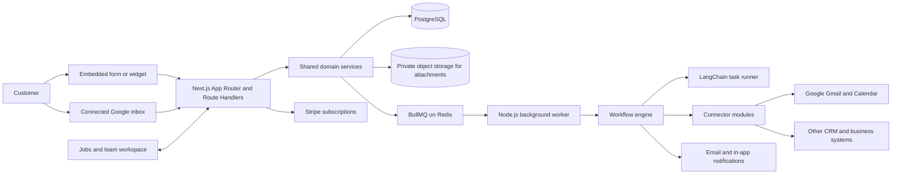
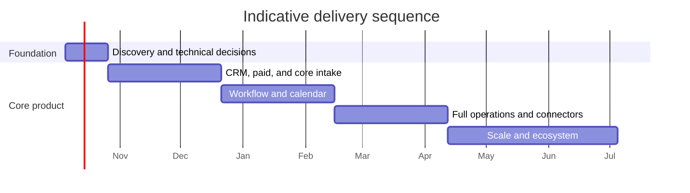

# SalesMora: Product and Delivery Roadmap

**Product domain:** [salesmora.ai](https://salesmora.ai)

## Summary

Build a US-first, subscription-based CRM for small and medium home-service businesses, starting with construction, plumbing, HVAC, electrical, and similar trades. The product connects lead capture to follow-up, estimates, scheduling, jobs, and team communication, with configurable workflows and AI assistance across those stages.

Use a modular TypeScript application built with Next.js App Router, PostgreSQL, and Railway. Use Next.js for the CRM web application and its backend-for-frontend layer; run long-lived and scheduled work in a separate Node.js worker service. Back the workflow engine with BullMQ on durable Redis. Use LangChain for bounded AI tasks such as lead extraction, classification, drafting, and workflow recommendations. Require user approval for outbound messages and consequential actions in the initial release. Follow the [U.S.-first privacy and messaging baseline](privacy-and-messaging-baseline.md); it is an implementation baseline pending qualified legal review, not a compliance certification.

### Component development and UI review

When the Next.js React component library is established, add Storybook as a development workbench for shared UI components and their visual/interactive states. Storybook should document and isolate reusable components; it does not replace the production application, route-level journey review, or browser testing. Use shared branding and providers through preview decorators, and supply mock data/actions rather than connecting stories to live services. See [Local Development Setup](local-development.md#ui-component-development-with-storybook) for the planned setup and official references.

## Product requirements and architecture

### Core product requirements

- **Lead capture:** Provide embeddable forms and widgets with configurable fields, validation, consent text, spam protection, and routing, plus authenticated Google email intake in Phase 1.
- **Account verification:** Let new owners complete organization setup and enter the workspace before verifying their email; require verification before sending teammate invitations or connecting Gmail.
- **Lead management:** Track source, customer details, service requested, location, urgency, qualification status, communication history, and ownership. Use the fixed MVP pipeline New, Contacted, Estimate sent, Won, and Lost; defer custom stage editing. Support deduplication and conversion into a customer and job.
- **Follow-up:** Let users configure event- and time-based triggers, such as immediately after capture, one day later, or when a lead goes stale. Support email first under the [privacy and messaging baseline](privacy-and-messaging-baseline.md); add SMS only after consent, deliverability, revocation, quiet-hour, and legal requirements are reviewed.
- **Estimates and scheduling:** Create and track estimates, record customer decisions, and schedule work against team availability. Keep the initial scheduling model practical for small teams rather than attempting complex dispatch optimization.
- **Jobs:** Convert qualified leads into jobs; assign team members, set dates and deadlines, track status and progress, and retain customer, estimate, and communication context.
- **Team notifications:** Notify assigned people about assignments, status changes, upcoming deadlines, and overdue work. Make notification preferences configurable.
- **Workflow automation:** Provide reusable triggers, conditions, actions, delays, and approval steps. Show execution history, action results, retries, and failures.
- **Subscriptions:** Support three plans—Free, Standard, and Premium—with self-service upgrades, downgrades, and billing management.
- **Integrations:** Support inbound and outbound integrations through versioned, permission-scoped connectors. Let a business choose whether a captured lead stays in SalesMora, is routed to another system, or follows a configured workflow.
- **Email marketing plugins:** In a future phase, let businesses connect campaign platforms such as Mailchimp to sync approved contacts and audience memberships, apply tags or segments through workflows, and bring campaign engagement events back into the CRM. Respect consent, unsubscribe, suppression-list, and provider rate-limit rules in every sync and automation.

### Proposed system shape

Deploy the Next.js web application, Node.js background worker, PostgreSQL, and Redis on Railway as separate services within one project, and create a private Railway Storage Bucket for uploaded documents and other binary objects. Use PostgreSQL as the system of record for tenant-scoped business data, workflow definitions, execution state, audit history, and object metadata; store file bytes in the bucket, not database rows or service filesystems. Use Knex with the PostgreSQL driver for query building and versioned schema migrations. Use BullMQ with Redis for delayed actions, retries, email intake, connector work, and agent tasks; the worker should process these jobs independently of web requests and survive restarts. The standard Railway Redis documentation does not guarantee the AOF and `maxmemory-policy=noeviction` settings BullMQ requires. Configure a persistent `/data` volume and a Redis start command with `--appendonly yes` and `--maxmemory-policy noeviction`, then verify restart recovery, queue behavior at the configured memory limit, and monitoring in staging. This customization makes Redis configuration, version upgrades, backups, and operational recovery our responsibility instead of Railway's managed-template support scope. If we cannot operate that setup reliably, revisit the queue deployment before production. Keep database and queue access behind shared server-side modules so the web service and worker use the same domain rules. [BullMQ production requirements](https://docs.bullmq.io/guide/going-to-production) · [Railway Redis deployment](https://docs.railway.com/databases/redis) · [Railway database support scope](https://docs.railway.com/databases).

Use private Railway Storage Buckets for job attachments. Authorize every upload/download against the signed-in user's organization and job membership before issuing short-lived presigned URLs. Generate opaque object keys server-side, validate size and file type, verify objects after upload, and record attachment actions in the audit/activity history. Removing a file must require explicit confirmation that it will be permanently lost; then destroy its per-file encryption key so any copies are unrecoverable and delete its object, retaining only non-content audit metadata. Maintain daily encrypted disaster-recovery copies of active attachments in a separate private Railway bucket with 30-day retention. Record durable deletion tombstones and apply them before restoring data so confirmed deletions cannot reappear; purge ciphertext for deleted attachments under the deletion process. Keep separate bucket instances and credentials for development, staging, and production, and inject credentials only into the services that need them through Railway variable references. Railway documents HTTPS endpoints and private access, but currently lists server-side encryption, object versioning, object locks, and bucket lifecycle configuration as unsupported. Use reviewed application-level envelope encryption with keys held outside the bucket for sensitive customer documents. Do not represent Railway bucket objects as encrypted at rest by Railway without a documented guarantee. [Railway Storage Buckets](https://docs.railway.com/storage-buckets), [Railway file upload/serving patterns](https://docs.railway.com/guides/storage-buckets-guide).

The attachment backup target is daily copies retained for 30 days, with an RPO of 24 hours and an RTO of one business day. Validate these targets through restore drills, and apply deletion tombstones before making restored data available.

Phase 1 job attachments accept JPEG, PNG, HEIC, WebP, PDF, DOCX, XLSX, and TXT files, with a 10 MB maximum per file; reject archives and executable formats. Users can add an optional short description per file; images and PDFs preview in-app, while other supported formats download for viewing.

Use Next.js App Router for the dashboard, form and widget builder, and customer-facing pages. Use Route Handlers for public widget submissions, OAuth callbacks, provider webhooks, and versioned external API endpoints. For server-rendered pages, call shared domain services directly rather than making an extra HTTP request to the app's own Route Handlers. Keep authorization, validation, tenant scoping, rate limits, and audit logging in server-side domain/API layers. Treat Route Handlers and Server Actions as request/response interfaces, not as the execution environment for delayed or long-running workflows. Store OAuth tokens and secrets securely, and keep them out of logs and agent prompts.

### Agentic workflows

The cross-screen assistant architecture, including trusted page context, per-surface tool scopes, context sources, vector-search options, and implementation stages, is described in [Context-Aware Agent Architecture](context-aware-agent-architecture.md).

Use LangChain as an orchestration and tool-calling layer for narrowly defined tasks, not as the source of truth for CRM records or workflow state.

| Workflow | AI role | Initial action policy |
|---|---|---|
| New widget submission | Normalize fields, classify service and urgency, flag missing information, suggest owner | Save structured result; user reviews uncertain fields |
| Email lead intake | Extract lead details and conversation context from authorized inbox messages | Create a proposed lead for review |
| Qualification | Summarize needs, identify unanswered questions, suggest priority and next step | Display rationale and source evidence |
| Follow-up | Draft a personalized response using approved business context and templates | User approval before sending |
| Workflow setup | Turn a plain-language request into a draft trigger/condition/action workflow | User reviews and activates |
| Estimate preparation | Summarize job scope and prepare estimate notes from CRM context | User reviews pricing and sends estimate |
| Job coordination | Summarize updates, flag deadline risk, draft customer/team notifications | User approves external messages; configured internal notifications may run automatically |
| Connector actions | Map fields and prepare create/update actions for connected systems | Require explicit workflow configuration and log results |

Every AI-generated or tool-mediated change should record its actor, input record references, action, outcome, and approval state. Require structured outputs, tool permissions, tenant scoping, idempotency, and bounded retries. Do not let an agent invent prices, commit schedules, or send customer communications without the relevant approval or explicit workflow authorization.

### Integration plan

| Integration | Purpose | Roadmap |
|---|---|---|
| Google OAuth, Gmail | Authorized lead intake and email context | Phase 1 |
| Google Calendar | Calendar visibility and job scheduling support | Phase 2 |
| Stripe Billing | Plan checkout, subscription lifecycle, invoices, and billing portal | Phase 1 |
| Resend | SalesMora-managed transactional email for invitations, notifications, and workflow follow-ups; separate from read-only Gmail intake | Phase 1 |
| SMS provider | Text follow-ups and deadline notifications | Phase 3, after consent and opt-out design |
| Salesforce | Lead export/routing and record updates | Phase 3 |
| Mailchimp or similar email marketing platform | Audience/contact sync, approved tag or segment updates, campaign engagement events, and workflow actions | Phase 4, after consent and subscription-preference rules are defined |
| QuickBooks or similar accounting system | Customer/job handoff and accounting sync | Phase 4 |
| Connector SDK | Add and configure integrations without embedding provider logic in workflows | Begin in Phase 1; expand in Phase 3 |

Implement connectors behind a consistent interface for authorization, capabilities, field mapping, execution, error reporting, and credential management. Workflows should call connector capabilities rather than provider-specific code. Support per-tenant credentials, permission scopes, webhook verification where applicable, and admin-visible connection status. Email marketing connectors should map SalesMora contacts to provider audiences and segments, record provider campaign events against the corresponding contact, and expose safe workflow actions such as adding an opted-in contact to an audience or applying a tag. Do not treat CRM status as permission to market: check consent and the provider's current unsubscribe/suppression state before any subscription or campaign action, and preserve provider-side opt-outs during synchronization.

## Phased execution

Indicative sequencing assumes a small product team and needs refinement after technical discovery. Each phase should produce a usable increment and a demonstration against the acceptance criteria below.

| Phase | Indicative duration | Deliverables and exit criteria |
|---|---:|---|
| **0. Discovery and technical foundation** | 2–3 weeks | Confirm core workflows with trade-business users; validate the Next.js App Router plus Node.js worker architecture; validate BullMQ against Railway Redis persistence and memory-policy settings; define the PostgreSQL data model and Knex migration conventions; define tenant isolation, permissions, audit events, and Railway service environments. Produce clickable product flows and architecture decisions. |
| **1. CRM, paid foundation, and core intake** | 6–8 weeks | Authentication, organizations, roles, customer and lead records, manual lead entry, lead pipeline, activity timeline, manual lead-to-job conversion, job creation and status board, assignments, basic notifications, Stripe plans and billing portal, website form/widget builder and embed code, secure form submissions, Gmail OAuth/intake, AI email extraction with supervised review, basic source setup and campaign dashboard (source status, captured/pending-review/approved counts, and Intake Review links), and Phase 1 post-approval actions (SalesMora lead creation, default or selected assignee, starting stage/tags, assigned-owner notification), Railway staging/production setup, audit trail, and privacy/security launch gates for the data and connectors in scope. |
| **2. Workflow automation and calendar** | 6–8 weeks | Round-robin and expanded notifications, configurable campaign-stage job conversion, external-system delivery, event/delay workflow builder, durable execution history, follow-up sequences and review, advanced campaign analytics, Google Calendar integration, AI follow-up drafts with approval. |
| **3. Full operations and connector platform** | 6–8 weeks | Estimate lifecycle, scheduling improvements, job deadlines and progress, configurable team notifications, connector SDK, Salesforce connector, workflow templates, plan limits and usage metering, SMS groundwork and consent controls. |
| **4. Scale and ecosystem** | Ongoing | QuickBooks or equivalent connector; Mailchimp or equivalent email marketing plugin for audience sync and engagement events; richer reporting, customer portal or job updates as validated, advanced workflow controls, integration catalog, reliability and cost improvements based on production usage. |

### Phase dependency chart

## Plans, quality, and assumptions

### Subscription tiers (initial proposal)

Set feature and usage limits through configuration so packaging can change without branching product logic. The provisional starting package below is a product hypothesis for prototypes and early customer conversations, not a launch commitment. Keep the current Free, Standard, and Premium figures unchanged as test candidates while validating them; do not enable paid billing until customer behavior and measured infrastructure/AI costs support the package.

| Tier | Intended customer | Proposed inclusion |
|---|---|---|
| **Free** | Solo operator evaluating the product | **$0/month**; 1 seat; core CRM and job management with unlimited active jobs; 1 GB attachment storage; basic reporting and CSV export; 100 new leads captured through intake per month; 1 published intake campaign; 1 active automation; 100 AI agent actions per month |
| **Standard** | Solo operator or small team | **$29/month**; 3 seats; everything in Free with 10 GB attachment storage; 1,000 new leads captured through intake per month; 5 published intake campaigns; 10 active automations; 1,000 AI agent actions per month; team collaboration, Gmail intake, and standard job notifications |
| **Premium** | Established or multi-crew business | **$49/month**; 8 seats; everything in Standard with 50 GB attachment storage; 5,000 new leads captured through intake per month; unlimited published intake campaigns; 50 active automations; 5,000 AI agent actions per month; configurable multi-offset job reminders, expanded team notification controls, advanced reporting, and premium integrations |

These are provisional monthly list prices in USD. Launch with monthly billing only; revisit annual billing discounts after gathering customer and retention data. “New leads captured through intake” counts new records created by campaign/form/email intake, not existing CRM records; CRM history remains accessible and active jobs are not capped by plan. An “AI agent action” is one completed tool-backed operation or generated intake/workflow task, not each chat message. Show usage and limits in product UI. Do not charge seat overages automatically. When the workspace reaches its seat limit, block new invitations and offer an upgrade. If a downgrade leaves more active members than the new limit, preserve their access and block further invitations until the workspace is within its seat allowance. Other usage caps are hard limits with no automatic overage charges: at a cap, block only the metered action, explain the limit and reset date, and offer an upgrade. Keep core CRM access and existing records available; do not delete business records because a usage cap was reached.

### Pricing and quota validation gate

1. In discovery interviews, show the current plan cards to home-service business owners and ask about tools they actually pay for, plan comprehension, and expected usage. Record their plan choices and objections as early feedback, not proof of willingness to pay.
2. In a working design-partner pilot, present the same candidate packages and observe actual plan choices, quota use, upgrade interest, and the cost of serving each tier. Make the pilot and any billing terms explicit; do not imply that stated interest is a purchase commitment.
3. Before enabling paid checkout, review the observed demand, quota fit, and unit economics. Adjust prices or limits only if that evidence supports a change. Until this gate is met, keep the prices and quotas provisional and do not enable live paid billing.

Customer interviews can surface packaging concerns, but observed choices and real commitments provide stronger evidence than stated willingness to pay. See [Strategyzer's pricing experiment guidance](https://www.strategyzer.com/library/how-to-run-pricing-experiments) and [willingness-to-pay testing guide](https://assets.strategyzer.com/assets/resources/testing-your-business-model-a-reference-guide.pdf).

The basic campaign dashboard and website/shareable-link intake are available on every plan, within the published-campaign limits shown above. Gmail intake is available on Standard and Premium. Premium-only integrations remain gated to Premium.

CSV exports are available to Owners/Admins on every plan, with no plan-specific row quota. A configurable technical request limit protects service capacity; never silently truncate export results. Large or bundled exports may use a background job in a later phase.

As a rough market reference checked October 9, 2026, Housecall Pro lists Basic at $79/month for one user, Essentials at $189/month for five users, and MAX at $329/month for eight users; Jobber lists Core from $29/month and Grow at $149/month annually for one user, with Plus starting at $399/month annually for five users. Salesmora's provisional Standard and Premium prices are intentionally positioned as lower-cost entry tiers. These products have different feature sets and billing structures, so use the comparison only as a positioning check, not a direct price match. [Housecall Pro pricing](https://www.housecallpro.com/pricing/) · [Jobber pricing](https://www.getjobber.com/pricing/).

Define plan entitlements for seats, intake-created leads, published intake campaigns, attachment storage, active workflow automations, AI agent actions, and connectors using the provisional values above. Do not cap active jobs or existing CRM history by plan. Show users their usage and plan limits, including attachment storage usage. After cancellation, keep business records available to the Owner to view and export for a 30-day grace period; do not immediately delete records. Implement this period in the billing lifecycle.

For a failed renewal, keep the workspace active during a seven-day payment-recovery period and notify the Owner. If payment remains unsuccessful after seven days, apply the plan's limits while preserving business records and the Owner's ability to view and export them.

### Test and acceptance plan

- **Lead capture:** A published form accepts valid submissions, rejects invalid or abusive submissions, records source and consent, and follows the selected route. Duplicate submissions are surfaced or merged according to a documented rule.
- **Lead-to-job lifecycle:** A lead can be qualified, assigned, converted, estimated, scheduled, and tracked as a job with a visible activity history.
- **Workflow engine:** Immediate and delayed triggers execute once, survive worker restarts, respect workflow versioning, retry transient failures, and expose failed runs for review.
- **AI controls:** Extraction and classification produce validated structured output; drafts cite relevant CRM context; unapproved external actions cannot be sent; all approved actions are auditable.
- **OAuth and connectors:** Revoked or expired Google access is handled visibly; tokens remain protected; connector failures do not silently lose workflow events; repeated delivery does not create duplicate records.
- **Tenant and permissions:** Users cannot access another organization’s records or credentials; role permissions are enforced for CRM, billing, workflow activation, and integration management.
- **Billing:** Checkout, upgrade, downgrade, cancellation, failed payment, webhook retry, and entitlement changes are reflected correctly and idempotently.
- **Operations:** Railway deployments support separate web and worker services, health checks, structured logs, Knex migrations, backups, and alerting for queue backlog and repeated workflow failures. Migration rollout and recovery are documented and run once per deploy.

### Assumptions and defaults

- Launch in the **United States**; design consent, privacy, and messaging behavior for that market first.
- The first broad release targets **full operations**, including estimates, scheduling, and job tracking, while delivering them incrementally by phase.
- Start agent behavior at **draft plus approval**; allow automatic actions only when an administrator explicitly configures and activates a bounded workflow.
- Use a **built-in workflow engine over BullMQ and Redis**, with PostgreSQL as the system of record and a separate Node.js worker for asynchronous execution. BullMQ requires Redis AOF persistence and `maxmemory-policy=noeviction`; Railway's standard Redis docs do not confirm these settings, so use a persistent custom-configured Redis service and verify restart recovery and memory-limit behavior in staging. Custom database configuration makes operations and upgrades our responsibility. [BullMQ production guidance](https://docs.bullmq.io/guide/going-to-production) · [BullMQ Redis compatibility](https://docs.bullmq.io/guide/redis-tm-compatibility) · [Railway Redis deployment](https://docs.railway.com/databases/redis) · [Railway database support scope](https://docs.railway.com/databases).
- Prioritize **Google and Stripe** early; add Salesforce and accounting integrations after core capture and operations workflows are stable.
- Add email marketing platforms such as **Mailchimp** as a future connector, with consent-aware audience synchronization and campaign-event history.
- Permission roles are Owner, Admin, and Member; Office and Field are separate work profiles and never grant access. Invitations default to Member; Owners/Admins can explicitly select Admin. See [User Journeys](user-journeys.md#agreed-permission-roles-and-work-profiles).
- Use Resend for SalesMora-managed email. Send through its Node.js SDK/API with idempotency keys, verify signed webhook events, and disable provider pay-as-you-go overages. As checked October 9, 2026, Resend lists Free at 3,000 emails/month with a 100/day cap and Pro at $20/month for 50,000 emails; the Pro overage rate is $0.90 per 1,000 if pay-as-you-go is enabled. The pricing page lists 30-day email data retention on Free, Pro, and Scale. Start with the free tier for development; select a production tier based on forecasted volume and recheck pricing, retention, data-processing terms, sending limits, and deliverability before launch. Gmail OAuth remains read-only for intake and reply monitoring. [Resend transactional pricing](https://resend.com/pricing?product=transactional) · [Resend idempotency keys](https://resend.com/changelog/idempotency-keys).
- Tier prices and quotas remain provisional until the pricing and quota validation gate above is completed; do not enable paid billing before then. Resend and BullMQ are selected; production validation must cover the Redis configuration/operations described above and Resend's current plan, retention, and data-processing terms. OpenAI is selected as the MVP model provider; evaluate GPT-6 Luna first and compare with GPT-6.1 Sol only if Luna misses the quality bar. Exact regional compliance obligations remain a Phase 0 decision to validate before dependent features launch.
